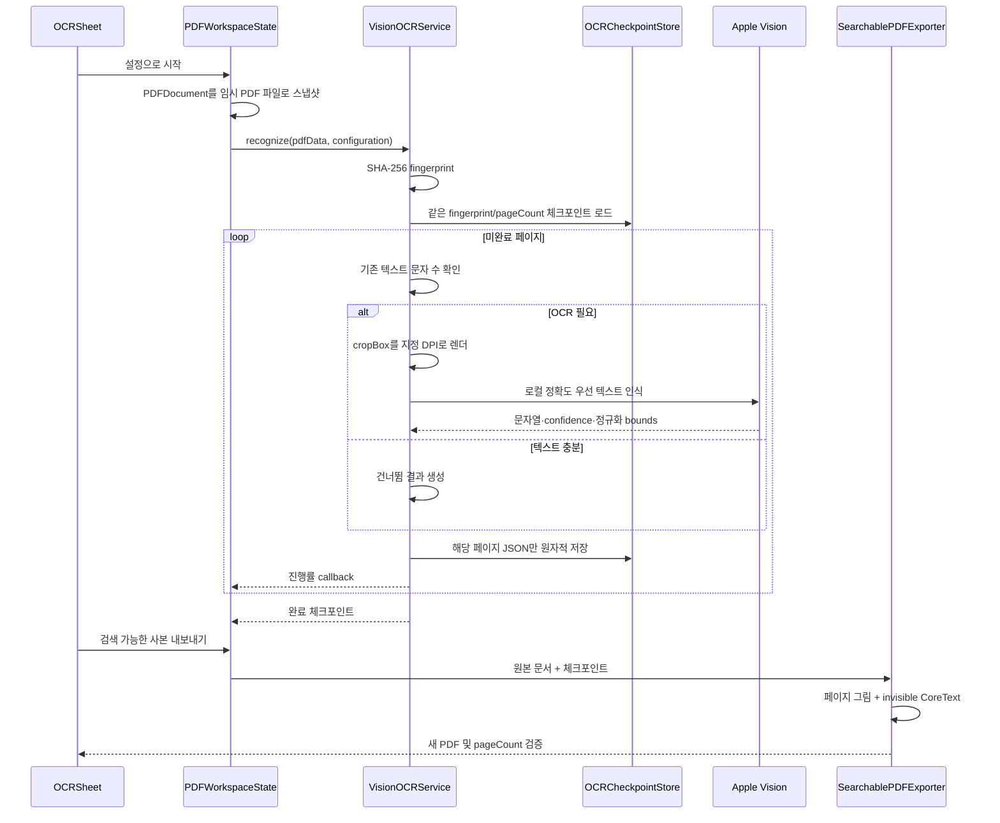

# HwattakPDF 아키텍처

> 2026-09-23 소스 갱신: HwattakPDF 이름 통일과 Finder 파일 열기 대응, 화면 모드·문서 아이콘·읽기·편집의 누적 개선을 0.9.0 소스에 정리했습니다. 제품 방향과 이번 검증은 [소스 갱신 기록](SOURCE-UPDATE-2026-09-23.md), 기능 범위는 [릴리스 노트](RELEASE-NOTES-0.9.0.md), 9월 22일 패키지 검증은 [기존 배포 검증 기록](RELEASE-VALIDATION-0.9.0.md)을 확인하세요.

> 2026-09-05 안정화 후속: [수정·성능·복구 검증](STABILIZATION-2026-09-05.md), [schema 3 문서 명령 API와 태블릿 입력](PLUGIN-HOST-API.md). 아래의 이전 단계 설명보다 후속 기록을 우선한다.

> 최초 기준일: 2026-08-28
> 최신 보완일: 2026-09-23
> 배포 준비 버전: 0.9.0 (build 19) Developer Preview · 직전 공개 버전: 0.8.0 (build 18)
> 0.9.0 포함: 이미지·HTML 기반 PDF 만들기와 페이지 이미지형 DOCX/PPTX 내보내기
> 현재 구현: macOS 14 이상, Swift Package, SwiftUI + AppKit + PDFKit + Vision + WebKit
> 목적: 현재 코드가 실제로 보장하는 경계와 다음 단계의 설계 방향을 구분한다.

## 1. 아키텍처 목표

- PDFKit을 활용해 macOS MVP를 빠르게 제공하되, PDFKit이 제공하지 않는 실제 콘텐츠 객체 편집을 별도 문제로 취급한다.
- UI가 살아 있는 `PDFDocument`를 직접 여러 스레드에서 만지지 않게 하고, 긴 작업은 불변 `Data` 스냅샷을 사용한다.
- 저장 전 직렬화·검증과 같은 폴더의 원자 교체를 우선해 기존 파일 손상 위험을 최소화하고, 파일 단위 샌드박스 권한 때문에 직접 쓰기가 필요한 예외 경로는 한계와 복구 절차를 명시한다.
- 대용량 OCR은 페이지마다 결과를 남겨 취소·충돌·앱 종료 후에도 재개할 기반을 갖춘다.
- 외부 서비스나 모델이 없어도 기본 읽기·주석·페이지 조립·OCR이 동작한다.
- 플러그인 schema 1의 엄격한 선언형 텍스트 action 호환성을 유지하고, schema 2는 앱 번들 검토본만 host-owned 웹 패널을 선택하게 해 다운로드한 패키지 코드를 앱 프로세스에 넣지 않는다.
- 여러 열린 PDF의 가변 상태를 탭별 단일 문서 세션으로 격리하고, 비교 화면은 이 세션을 복제하지 않고 참조한다.
- 뷰어·에디팅·학습 모드의 권한을 중앙 capability policy로 결정해, 화면·드롭·단축키·오버레이가 같은 편집 경계를 지키게 한다.
- 향후 iPad가 문서 연산과 작업 체크포인트를 재사용할 수 있게 플랫폼 의존성을 점진적으로 격리한다.

## 2. 현재 시스템 개요

```mermaid
flowchart TB
    App["HwattakPDFApp · 메뉴와 Window/WindowGroup"] --> Multi["창별 MultiDocumentWorkspaceState @MainActor"]
    App --> SessionStore["WorkspaceSessionStore · 보안 북마크 + 원자 JSON"]
    App --> Shell["TabbedWorkspaceView"]
    App --> PluginManager["PluginManager · bounded 선언형 registry"]
    App --> BuilderUI["ImagePDFBuilderView · PDF 변환 작업대"]
    PluginManager --> PluginRunner["PluginActionRunner · host-rendered action"]
    PluginRunner --> PluginEffects["v1 · 대화상자 · 클립보드 · 승인된 기본 브라우저"]
    PluginRunner --> PanelRequest["v2 · immutable bounded PluginPanelRequest"]
    PanelRequest --> PanelHost["PluginPanelHostView · 앱 소유 패널"]
    PanelHost --> PanelWeb["nonPersistent WKWebView · scoped top-level policy"]
    PanelWeb --> RemotePanelSites["번역 · YouTube · 공개 HTTPS 사이트"]
    Multi --> Sessions["PDFTabSession 배열 · activeTabID"]
    Sessions --> State["탭별 PDFWorkspaceState @MainActor"]
    Shell --> TabBar["PDFTabBar · 선택·재정렬·닫기"]
    Shell --> Workspace["탭별 WorkspaceView"]
    Shell --> Compare["PDFComparisonView · 2~4개 세션 참조"]
    Shell --> Memory["PDFTabMemoryManager · resident 예산 + 메모리 압력"]
    TabBar --> Multi
    Workspace --> State
    Compare --> State
    Compare --> Sync["PDFScrollSyncCoordinator · 정규화 스크롤"]
    BuilderUI --> Assembly["ImagePDFAssemblyModel · 순차 조립·진행·취소"]
    Assembly --> ImageConvert["ImagePDFConverter · bounded image decode"]
    Assembly --> HTMLConvert["HTMLPDFConverter · local-only WebKit A4 capture"]
    Assembly --> OCR
    Assembly --> Writer

    Workspace --> PDFView["PDFKitViewer · InteractivePDFView"]
    Workspace --> Grid["1~12페이지 LazyVGrid · 썸네일 캐시"]
    Workspace --> SearchUI["검색 사이드바 · 페이지별 문맥 navigator"]
    Workspace --> ModeUI["WorkspaceToolbar · 뷰어/에디팅/학습"]
    ModeUI --> ModePolicy["PDFWorkspaceModePolicy · capability gate"]
    Workspace --> InlineText["PDFInlineTextEditingOverlay · bounded FreeText editor"]
    Workspace --> StudyUI["StudyModePalette · AI/메모/표식"]
    Workspace --> ShareNote["PDFShareNoteSheet · bounded plain text"]
    Workspace --> Sign["AppKit 트랙패드 서명 캔버스"]
    Sign --> Keychain["현재 사용자 Keychain · 기본 서명 벡터"]
    Workspace --> OCRUI["OCR 설정·진행 UI"]
    Workspace --> AIUI["AIAssistantSidebar · 범위·동의·대화·MCP 승인"]
    Workspace --> PanelHost
    Compare --> PDFView

    State --> Doc["메모리의 PDFDocument"]
    State --> PageOps["페이지 복사·추출·병합"]
    State --> VersionedAccess["PDFSourceFileAccess · coordinated version 확인"]
    VersionedAccess --> Writer["검증 저장·원자 교체 우선"]
    State --> OCR["VisionOCRService"]
    State --> Panels["NSOpenPanel · NSSavePanel"]
    State --> Search["PDFSearchEngine · 취소 가능한 Unicode page scan"]
    State --> ModePolicy
    State --> AISession["탭별 AIAssistantSessionModel"]
    State --> Office["PDFOfficeExporter · 페이지 PNG 기반 DOCX/PPTX"]
    AIUI --> Context["PDFAIContextExtractor · bounded text + S1 markers"]
    AIUI --> Related["LocalRelatedPDFSearchService · transient serial read"]
    AIUI --> Provider["AIService · provider adapters + response cap"]
    Provider --> AIKeychain["비동기화 Keychain · provider+UUID credential"]
    Provider --> RemoteAI["명시적 외부 AI / web / remote MCP"]

    OCR --> Snapshot["임시 PDF 파일 스냅샷 + 스트리밍 SHA-256"]
    OCR --> Checkpoint["manifest + 세대별 페이지 JSON 체크포인트"]
    OCR --> Vision["Apple Vision 로컬 OCR"]
    OCR --> Exporter["Core Graphics 검색 가능 PDF 출력"]

    Writer --> Files["로컬 · iCloud Drive · Finder 파일 제공자"]
    Panels --> Files
    Checkpoint --> AppSupport["Application Support/HwattakPDF"]
    SessionStore --> AppSupport
    PluginManager --> AppSupport
    Exporter --> Files
    Office --> Files
```



## 3. 소스 구성과 책임

| 영역 | 주요 파일 | 현재 책임 |
| --- | --- | --- |
| 앱 진입점 | `App/HwattakPDFApp.swift`, `App/AppEditCommandRouter.swift`, `App/UnsavedChangesGuard.swift` | 주 창과 UUID `WindowGroup`, focused command routing, 텍스트 편집기 우선 실행 취소, 창·앱 종료 시 모든 탭의 미저장 상태 확인과 최종 세션 flush/freeze |
| 다중 문서 상태 | `Models/MultiDocumentWorkspaceState.swift`, `Models/PDFTabGroup.swift`, `Models/RecentDocumentsStore.swift`, `Models/WorkspaceSessionStore.swift` | 탭·워크스페이스·그룹 정규화, 최근 PDF와 전체 세션의 security-scoped bookmark 기록·복원, 비활성 lazy restore |
| 탭 작업공간 | `Views/TabbedWorkspaceView.swift`, `Views/PDFTabBar.swift`, `Views/WelcomeView.swift` | 전체 이름 툴팁, 좌/중앙/우 drop에 따른 재정렬·스택 생성, 스택 접기·이름·멤버 관리, PDF 본문과 사이드바를 모두 덮는 단일 Finder fileURL drop 경계, 최근 PDF 7개, 비교 모드 진입·종료 |
| 변환 작업대 | `Views/ImagePDFBuilderView.swift`, `Models/ImagePDFAssemblyModel.swift`, `Models/PDFConversionPlanning.swift` | 이미지·HTML·선택 PDF 페이지·A4 공백의 순서 편집, 안정성/속도 방식과 휴리스틱 예상치, 선택적 OCR, 진행·취소와 실제 결과 표시 |
| 문서 변환 | `Services/ImagePDFConverter.swift`, `HTMLPDFConverter.swift`, `PDFOfficeExporter.swift`, `OpenXMLArchiveWriter.swift` | bounded 이미지 decode와 1페이지 PDF 미리보기, local-only HTML의 페이지별 벡터 A4 캡처, PDF 페이지 PNG 기반 DOCX/PPTX Open XML 생성 |
| 리소스·수명 | `Models/ResourceMonitorModels.swift`, `Services/ProcessResourceMonitor.swift`, `Services/PDFTabMemoryManager.swift`, `Views/ResourceMonitorView.swift` | 앱 프로세스 CPU·RSS 계측, 탭별 예상 부담, resident 문서 예산·LRU 휴면·Darwin memory-pressure 대응 |
| 문서 화면 | `Views/WorkspaceView.swift`, `WorkspaceToolbar.swift`, `StudyModePalette.swift`, `PDFShareNoteSheet.swift`, `PageSidebarView.swift`, `SearchNavigatorSidebarView.swift`, `PageJumpControl.swift`, `WorkspaceFileDrop.swift` | 활성 문서의 열기/저장/병합/추출/OCR/서명 흐름, 모드 선택, 학습 AI·메모·표식 팔레트, Viewer/Study bounded 메모 공유, 전체 문서 검색과 페이지별 문맥 navigator, Finder drop, 페이지 이동·패널·선택·드래그 재정렬 |
| 작업 모드 정책 | `Models/PDFWorkspaceMode.swift` | 뷰어·에디팅·학습의 capability·입력 도구·툴바 section을 한 표에서 결정하고 annotation kind별 편집 권한과 mode 전환 시 도구 정규화 제공 |
| 제품 소개 | `Views/AboutView.swift`, `Resources/AboutAuthor-SeederPowerDrop-UserProvided.jpg` | 고정 라이트 팔레트의 레트로 정보 창, 사용자 제공 그림·제작 배경·GitHub·후원 링크 |
| 도움말 | `Views/HelpTutorialView.swift` | 도움말 메뉴의 독립 창, 실제 기능·SF Symbol·단축키 데이터, 주제 탐색·검색과 VoiceOver/RTL 표시 |
| 선언형 플러그인 | `Plugins/PluginModels.swift`, `PluginManifestValidator.swift`, `PluginPackageValidator.swift`, `PluginManager.swift`, `PluginActionRunner.swift`, `PluginWebURLPolicy.swift`, `App/PluginCommands.swift`, `Views/PluginManagerView.swift`, `PluginPanelHostView.swift` | schema 1·2의 엄격한 파일·권한·크기 검증, 검토 bytes의 staged 설치·무결성 확인, v1 텍스트/기본 브라우저 action, 번들 identifier+digest가 일치하는 v2 앱 소유 번역·YouTube·공개 HTTPS 패널, scoped WebKit 정책과 lifecycle 폐기 |
| PDF 비교 | `Models/ComparisonModels.swift`, `Views/PDFComparisonView.swift`, `Views/ComparisonSetupSheet.swift`, `Views/PDFScrollSyncCoordinator.swift` | 열린 세션 2~4개 선택·순서·배치, 좌우/위아래 패널, 정규화 스크롤 동기화와 문서별 잠금 |
| PDF 보기 입력 | `Models/PDFViewportScrollInteraction.swift`, `Views/SettingsView.swift` | 유한한 스크롤 delta와 정확히 일치하는 수정키 조합을 native·확대·가로 이동 의도로 분류하고, 기본 `⌥` 확대 키를 `⌘` 또는 끔으로 바꾸는 사용자 설정 제공 |
| PDF 편집 보기 | `Views/PDFKitViewer.swift`, `PDFImageEditingOverlay.swift`, `PDFInlineTextEditingOverlay.swift`, `Models/InlineTextEditing.swift` | SwiftUI와 `PDFView` 연결, 1·2페이지 모드, 페이지/선택 동기화, 포인터 고정형 수정키 확대와 가로 이동, 모드별 텍스트·펜·지우개 입력, bounded 인라인 FreeText 편집, 추가한 텍스트·서명·이미지 선택·이동, 이미지 자르기·레이어 편집 |
| 다중 페이지 개요 | `Views/PDFGridOverview.swift`, `PDFGridInputMonitor.swift`, `PageThumbnailView.swift` | 3~12열 지연 그리드, 현재 보이는 페이지 추적, 수정키 확대·가로 이동과 네이티브 핀치 연결, `NSCache` 기반 페이지 이미지 캐시 |
| 서명 | `Views/SignatureCaptureView.swift`, `SignatureSheet.swift`, `Services/SecureSignatureStore.swift` | 트랙패드/마우스 입력, 보정·스탬프 출력, 버전형 벡터 서명의 현재 사용자 Keychain 자동 저장·로드·교체·삭제 |
| 단일 문서 상태·유스케이스 | `Models/PDFWorkspaceState.swift`, `Models/PDFDocumentSearch.swift`, `Models/PDFEditHistory.swift` | 한 탭의 열린 문서, 선택, 취소 가능한 Unicode 검색·진행률·결과 범위, 변경 상태, 페이지 연산, 주석, 서명, 문서별 22단계 델타 이력과 저장 체크포인트, OCR 작업 조율 |
| 공유 모델 | `Models/WorkspaceModels.swift` | 도구, 잉크·서명·OCR 설정과 결과, 체크포인트, 사용자 오류 |
| 페이지 연산 | `Services/PDFPageOperations.swift` | `PDFPage` 분리 복사, 정렬된 선택 페이지 추출, 문서 끝 병합 |
| 저장 | `Services/PDFSourceFileVersion.swift`, `AtomicPDFWriter.swift` | 열기·재개·저장 시 가벼운 원본 버전 기록, 같은 원본 덮어쓰기 직전 coordinated 비교, 같은 부모 폴더의 임시 파일 검증 뒤 move/replace 우선, 파일 단위 권한용 검증 직접 쓰기 fallback |
| OCR | `Services/VisionOCRService.swift`, `OCRCheckpointStore.swift` | 렌더링, Vision 인식, SHA-256 식별, 페이지별 체크포인트 |
| OCR PDF 출력 | `Services/SearchablePDFExporter.swift` | 원본 페이지를 다시 그리고 인식 박스 위치에 보이지 않는 텍스트 추가 |
| 이미지 오버레이 | `Services/ImageStampAnnotation.swift`, `Models/ImageAnnotationEditing.swift`, `Models/PDFWorkspaceState+ImageAnnotations.swift` | 원본은 편집 중 메모리에만 두고, 보이는 crop 픽셀만 독립 래스터로 만들어 PDF appearance에 넣는 스탬프 주석, 편집 좌표 계산과 이미지 레이어 재정렬 |
| 학습 표식·공유 | `Models/StudyModeModels.swift`, `StudyMarkupAnnotation.swift`, `PDFShareNote.swift` | 학습 AI 빠른 작업 mapping, 색상·두께·진하기 설정, appearance-backed Stamp 표식, live `PDFSelection`을 보관하지 않는 bounded 선택문·메모 일반 텍스트 snapshot |
| 파일 접근 | `Services/WorkspaceFilePanels.swift`, `Support/SecurityScopedAccess.swift` | 시스템 파일 패널과 security-scoped resource 수명 관리 |
| AI 문맥·로컬 검색 | `Models/PDFAIContextModels.swift`, `Services/PDFAIContextExtractor.swift`, `TransientPDFTextSampler.swift`, `LocalRelatedPDFSearchService.swift` | 선택/페이지/대표 문서 문맥의 문자·페이지 상한, 로컬 경로를 제외한 근거 marker, 휴면 탭을 깨우지 않는 관련 PDF 검색 |
| 외부 AI 공급자 | `Models/AIProviderModels.swift`, `AIProviderSettingsStore.swift`, `Services/AIProviderService.swift`, `SecureAIAPIKeyStore.swift` | 공식 endpoint 고정, OpenAI/Anthropic/Gemini/OpenAI-compatible 요청·응답 변환, 웹 인용, MCP always-approval 연속 요청, Keychain 자격 증명 |
| AI UI와 탭 상태 | `Models/AIAssistantPresentation.swift`, `AIAssistantSessionModel.swift`, `Views/AIAssistantSidebar.swift` | 빠른 작업, 탭별 제한 대화, 전송 미리보기·동의, 취소, 로컬/웹 출처, MCP 호출별 결정, 검토형 텍스트 초안 적용 |

현재 패키지는 Swift tools 6.0을 사용하지만 타깃은 Swift 5 언어 모드로 컴파일한다. `scripts/build_app.sh`가 문서 타입과 샌드박스 파일 접근 entitlement를 가진 개발용 ad-hoc 앱 번들을 만든다. Developer ID 서명, hardened runtime, notarization과 App Store 프로비저닝은 별도 출시 작업이다.

## 4. 상태와 문서 소유권

### 4.1 `MultiDocumentWorkspaceState`

앱의 루트 `@StateObject`는 `MultiDocumentWorkspaceState`다. 이 객체는 `@MainActor`에서 `PDFTabSession` 배열과 `activeTabID`를 관리하고, 각 세션은 고유한 `PDFWorkspaceState` 하나를 소유한다. `TabbedWorkspaceView`는 이 상태를 관찰해 탭 막대와 문서 작업공간 또는 비교 화면을 조합한다.

현재 탭 불변 조건:

1. 탭 배열에는 항상 하나 이상의 세션이 있다. 마지막 탭을 닫으면 새 빈 세션을 즉시 만든다.
2. PDF를 열 때 변경 없는 빈 탭이 있으면 활성 탭을 우선해 그 세션을 재사용한다.
3. 표준화하고 심볼릭 링크를 해소한 파일 경로가 이미 열려 있으면 새 세션을 만들지 않고 기존 탭을 선택한다.
4. 새 문서는 임시 `PDFWorkspaceState`에서 열기에 성공한 뒤에만 탭 배열에 들어간다. 실패한 URL 때문에 빈 문서 탭이 남지 않는다.
5. 각 세션의 `objectWillChange`를 루트가 중계해 탭 제목과 dirty 표시가 문서 상태 변화에 맞춰 갱신된다.
6. 그룹 멤버는 평면 탭 순서에서 연속 블록을 이루고, 각 탭 ID는 최대 한 그룹에만 속한다. 재정렬·닫기·그룹 이동 뒤 빈 그룹과 잘못된 멤버를 즉시 정규화한다.
6. `closeTab`은 dirty 세션을 직접 버리지 않는다. 호출자는 먼저 `UnsavedChangesGuard`로 저장·버리기·취소 결정을 끝내야 한다.

`TabbedWorkspaceView`는 활성 탭의 `WorkspaceView`/`PDFView`만 생성한다. 탭을 전환해도 `PDFWorkspaceState`는 유지하지만 이전 AppKit 뷰 계층은 dismantle해 렌더 타일과 관찰자를 해제한다. `PDFTabMemoryManager`는 기본 3개(설정 1~12개)의 `PDFDocument`만 resident로 두며, clean 비활성 탭은 URL·페이지/선택 상태를 남긴 채 휴면한다. dirty·pending text·OCR·비교 중 문서는 고정되고 선택 시 동기적으로 재개된다.

`WorkspaceSessionStore`는 workspace/tab/group ID와 순서, 활성 상태, 2페이지 연속·고정 선택을 포함한 보기 상태, security-scoped bookmark를 버전형 JSON으로 원자 저장한다. 비활성 문서는 `restoreHibernated`로 PDFKit parsing 없이 복원한다. 종료 확인 직전 정상 스냅샷을 flush하고 teardown 동안 persistence를 freeze하므로 빈 placeholder가 마지막 세션을 덮어쓰지 않는다. 미저장 PDF 바이트는 이 manifest에 포함하지 않는다.

### 4.2 `PDFWorkspaceState`

`PDFWorkspaceState`는 `@MainActor`인 단일 문서 세션이다. 화면과 `PDFView`가 관찰하는 값은 이 객체를 통한다.

주요 상태:

- `document`, `documentURL`, `sourceFileVersion`, `hibernatedPageCount`: resident PDFKit 문서, 마지막으로 읽은 원본의 가벼운 파일 버전, 휴면 중에도 유지되는 URL/페이지 메타데이터
- `selectedPages`, `currentPageIndex`: 페이지 조립과 뷰 탐색 상태
- `pageColumns`, `twoPageDisplayMode`: 1·2열 PDFKit 보기 또는 3~12열 개요 선택과 2열 연속·고정 펼침 선택
- `mode`, `studyMarkupStyle`: 탭별 뷰어·에디팅·학습 목적과 학습 표식의 색상·두께·진하기
- `revision`: 페이지 또는 주석 변경 후 썸네일·뷰 갱신 키
- `isDirty`: 저장되지 않은 메모리 변경 표시
- `canUndo`, `canRedo`, action name: 문서별 명령 이력의 현재 메뉴 상태
- `activeTool`, `inkSettings`, `signatureSettings`: 입력 모드와 렌더 파라미터
- `pendingInlineTextEdit`: 아직 PDFAnnotation으로 commit되지 않은 에디팅 모드의 bounded AppKit 초안과 appearance 설정
- `currentSelection`, `searchNavigatorResults`, `activeSearchSelection`, `searchProgress`: PDFKit 텍스트 선택, 가벼운 페이지별 검색 결과, 현재 한 건의 지연 생성 선택과 진행 상태
- `ocrState`, `ocrCheckpoint`, `ocrTask`: 한 번에 하나인 OCR 작업과 진행 상태

현재 불변 조건:

1. 살아 있는 `PDFDocument` 변경은 주로 메인 액터에서 수행한다.
2. 페이지 선택 인덱스는 문서 변경 후 새 범위로 갱신한다.
3. 되돌릴 수 있는 PDF 변경은 `PDFEditHistory`에 이미 수행된 변경과 역변경을 한 명령으로 등록하고, 현재 상태 토큰과 마지막 저장 토큰의 일치 여부로 dirty 상태를 계산한다.
4. 다른 문서로 넣을 페이지는 `PDFPageOperations.detachedCopy`로 복사해 원본과 대상 문서가 같은 `PDFPage` 인스턴스를 공유하지 않게 한다.
5. OCR은 UI가 가진 `PDFDocument`를 백그라운드에서 직접 사용하지 않고 임시 PDF 파일로 직렬화한 스냅샷을 별도 `PDFDocument`로 연다.
6. 일반 명령은 변경된 주석 객체·좌표·문자열·페이지 참조만 보관한다. 이력은 22개, 분리된 페이지를 붙드는 구조 명령은 합계 64페이지로 제한하며 PDF 전체 직렬화본을 명령마다 만들지 않는다.
7. clean 탭을 휴면하기 직전에 이력을 비워 명령 closure가 이전 `PDFDocument` 그래프를 붙들거나 재개 뒤 숨은 문서를 수정하지 못하게 한다.
8. 검색은 페이지 문자열만 메인 액터에서 얻고 NFKC·대소문자·발음 구별 부호·전각/반각·공백 정규화와 스니펫 계산은 취소 가능한 detached worker에서 수행한다. 문서 revision이나 query가 바뀌면 세대 토큰으로 늦은 결과를 폐기한다.
9. 최대 20,000개의 navigator 결과에는 페이지와 UTF-16 범위만 보관하고 `PDFSelection`은 현재 결과 한 건에만 지연 생성해 PDFKit 객체 그래프를 제한한다.
10. 원본과 같은 위치에 저장할 때는 열기·재개·직전 저장에서 캡처한 크기·수정일·파일시스템 node 버전을 coordinated write accessor 안에서 다시 비교한다. 다르면 외부 bytes를 건드리지 않고 dirty 메모리 문서와 오류를 유지한다.
11. mode는 PDF 바이트나 dirty 상태를 바꾸지 않는다. `PDFWorkspaceModePolicy`가 capability를 결정하며, 에디팅을 떠나기 전에는 live 인라인 초안을 먼저 commit/cancel 경계로 보낸다.

### 4.3 현재 탭 세션과 창의 한계

탭 tear-out은 URL을 다시 여는 대신 기존 `PDFTabSession`을 UUID 기반 `WindowGroup`으로 이전하므로 실행 중에는 미저장 편집과 보안 범위가 유지된다. 앱 종료 시 manifest에는 메인/분리 창별 workspace 소속과 비교 구성을 함께 기록하고 다음 실행에서 value 기반 `WindowGroup`으로 창 구성을 다시 만든다. 다만 공개 SwiftUI 복원 API로 정확한 화면 좌표와 크기를 이식할 수 없어 창 geometry는 기본 배치로 다시 생성된다. 원본 덮어쓰기 직전의 coordinated 버전 확인은 구현했지만 `NSFilePresenter`로 편집 중 변경을 계속 알리거나 두 버전을 병합하는 범용 `NSDocument` 흐름은 아직 없다. 리소스 모니터는 앱 전체 CPU·RSS를 실측하지만 하나의 프로세스가 공유하는 PDFKit 캐시와 CPU 시간을 파일별 실제 값으로 분리하지는 못한다.

각 `PDFWorkspaceState`는 최대 22개의 `PDFEditCommand`를 독립적으로 가진다. 펜·하이라이트·자유 텍스트·서명·이미지·양식 값·페이지 구조 편집은 `⌘Z`와 `⇧⌘Z`로 이동한다. 비교 화면은 읽기 전용이므로 문서 undo/redo와 변이 명령을 차단한다. 일반 문서 창에서 AppKit `NSTextView`가 편집 중이면 해당 native `UndoManager`가 우선하고 서명 캔버스가 열린 sheet에서는 문서 단축키를 등록하지 않는다. 이 이력은 충돌 복구 저널이 아니며 앱 재실행이나 clean 탭 휴면을 넘겨 보존하지 않는다. `UnsavedChangesGuard`도 자동 저장이나 복구 저널을 대체하지 않는다.

## 5. 보기 계층

### 5.1 작업 모드 capability 경계

`PDFWorkspaceMode`는 탭별 세션 값이며 메뉴와 toolbar에서 `⌃1` 뷰어, `⌃2` 에디팅, `⌃3` 학습으로 전환한다. 기능 코드는 mode를 직접 비교하지 않고 `PDFWorkspaceModePolicy` 또는 `workspace.allows(_:)`에 capability를 묻는다.

| 모드 | 주요 허용 capability |
| --- | --- |
| 뷰어 | 읽기·선택·복사/붙여넣기, 댓글형 FreeText, 그래픽 서명, 번역·AI, OCR, bounded 메모 공유 |
| 에디팅 | 인라인 FreeText, 이미지/서명 이미지 삽입, 그래픽 서명, 펜·지우개, 페이지 조립, OCR |
| 학습 | 댓글형 타이핑 메모, 펜·지우개, 번역·AI 학습 도구, 조절형 표식, OCR, bounded 메모 공유 |

Viewer/Study의 텍스트 도구는 메모 주석이고, Editing에서만 페이지 클릭이 직접 인라인 FreeText editor를 연다. Editing은 이미지와 페이지 구조를 바꿀 수 있지만 외부 AI를 노출하지 않으며, Viewer/Study만 공유 메모를 제공한다. 공급자·개발자 API 키가 없거나 요청별 전송 미리보기에 동의하지 않으면 AI capability가 보여도 네트워크 요청은 시작되지 않는다.

### 5.2 1·2페이지 보기

`PDFKitViewer`는 `NSViewRepresentable`로 `InteractivePDFView`를 감싼다.

- 1열: `singlePageContinuous`
- 2열 연속 보기: `twoUpContinuous`
- 2열 고정 보기: `twoUp`으로 현재 펼침만 렌더링하고 두 페이지 단위로 이동
- `displaysAsBook = false`를 유지해 첫 페이지를 단독 표지로 빼지 않고 1–2, 3–4 순서로 묶는다. 마지막 홀수 페이지는 빈 슬롯과 함께 한 장만 표시한다.
- 비교 패널은 정규화된 스크롤 위치만 동기화하므로 2열 고정 선택과 무관하게 기존 연속 모드를 유지한다.
- 페이지 변경 알림을 `currentPageIndex`에 반영
- PDFKit 선택을 `currentSelection`에 반영
- `⌘F` 검색은 페이지별 UTF-16 범위와 문맥만 최대 20,000개 보관하고, 현재 결과 한 건만 `PDFSelection`으로 만들어 `highlightedSelections`와 현재 페이지에 반영
- 검색 query·문서 revision·세대 토큰을 함께 확인해 취소·탭 휴면·페이지/주석 변경 뒤 늦게 도착한 결과를 버린다. 텍스트 층이 전혀 없는 문서는 검색 완료 뒤에만 OCR 안내를 표시한다.
- 수정키 확대는 기본 `⌥`이며 설정에서 `⌥`·`⌘`·끔을 선택한다. 선택한 키만 정확히 누른 스크롤을 확대 의도로 처리하므로 `⌥⇧`, `⌥⌘`, `⌘⇧` 같은 조합은 임의로 소비하지 않는다.
- 수정키 확대는 현재 포인터 아래의 PDF 페이지 좌표가 화면에서 유지되도록 배율과 clip bounds를 함께 조정한다. 배율은 `PDFView` 자체 한계를 우선하면서 워크스페이스의 5%~2,000% 안전 범위를 넘지 않는다.
- `⇧`만 누른 세로 휠은 같은 clip view의 가로 이동으로 변환한다. 수정키 없는 세로·가로 스크롤과 PDFKit의 핀치 확대는 원래 이벤트 경로에 남긴다.
- 뷰어/학습의 텍스트 도구는 클릭 위치에 댓글/학습 FreeText 메모를 추가하고, 에디팅의 텍스트 도구는 클릭 위치에 인라인 editor를 열거나 HwattakPDF가 식별한 FreeText를 같은 경로로 수정
- 펜 도구는 화면 좌표를 페이지 좌표로 변환해 Ink 주석 생성
- 지우개는 Ink·FreeText·Highlight·Stamp 같은 편집 주석만 제거하며 Widget·Link·Popup·Redact는 제외

Apple PDFKit의 공식 [`PDFDisplayMode`](https://developer.apple.com/documentation/pdfkit/pdfdisplaymode)는 단일 페이지와 2페이지 모드를 제공하지만 3페이지 이상의 편집 모드는 제공하지 않는다.

### 5.3 3~12페이지 개요

3~12열은 PDFKit의 문서 뷰를 억지로 확장하지 않고 `LazyVGrid`에 페이지 썸네일을 배치한다. 툴바는 1·2·4페이지 아이콘 바로가기와 1~12열 숫자 입력을 제공한다. `PageJumpControl`은 1-based 페이지 번호를 검증한 뒤 `PDFWorkspaceState.setCurrentPage(_:)`의 0-based 인덱스로 변환하며, 툴바와 페이지 패널이 같은 이동 경로를 쓴다. `WorkspaceView`는 좌·우·상·하에 배치할 수 있는 페이지 패널, 현재 페이지 HUD, 마우스·키보드·VoiceOver로 조절하는 패널 구분선을 조합한다. 세로 배치 폭과 가로 배치 높이는 별도 설정으로 저장된다.

- 화면에 필요한 셀부터 만들며 세로·가로 스크롤을 허용한다.
- 캐시는 revision, 페이지 인덱스, 요청 폭, 회전을 키에 포함한다.
- `NSCache`의 항목 수와 총 비용 상한으로 메모리 압력을 제한한다.
- `PDFGridInputMonitor`는 같은 `PDFViewportScrollIntentResolver`와 확대 키 설정을 사용한다. 정확한 `⌥` 또는 `⌘` 스크롤은 기존 개요 배율 70%~160% 안에서 중앙 기준 미리보기 후 확정하고, `⇧`만 누른 세로 휠은 가로 이동으로 바꾼다.
- 수정키 없는 세로·가로 스크롤과 핀치 확대는 기존 그리드 스크롤 및 4페이지 묶음 전환 정책을 유지한다.
- 클릭은 페이지 선택, 이중 클릭은 1열 편집 보기 전환이며 card drag/drop은 페이지 순서를 변경한다.

따라서 3~12열은 **개요 및 페이지 선택 모드**다. 이 모드에서 본문 선택이나 정밀 주석 편집이 가능하다고 가정하면 안 된다.

### 5.4 2~4개 PDF 비교

`TabbedWorkspaceView`는 열린 문서 세션을 가벼운 `ComparisonDocument`로 감싸 비교 UI에 전달한다. 이 어댑터는 문서를 복사하지 않고 기존 `PDFWorkspaceState`를 참조하므로 비교를 끝내도 원래 탭 상태와 dirty 여부가 유지된다.

`PDFComparisonConfiguration`이 관리하는 값:

- 선택한 문서 ID 2~4개와 패널 표시 순서
- 좌우(`sideBySide`) 또는 위아래(`stacked`) 배치
- 전체 스크롤 동기화 사용 여부
- 동기화에서 완전히 제외할 잠긴 문서 ID

`PDFScrollSyncCoordinator`는 각 `PDFView` 내부 `NSClipView`의 bounds 변화를 관찰한다. 원본의 문서 프레임과 뷰포트에서 가로·세로 진행률을 0~1로 정규화하고, 대상 문서의 프레임과 뷰포트에 다시 매핑한다. 크기·페이지 수·확대 상태가 다른 문서에서도 절대 픽셀 좌표를 그대로 복사하지 않는다. 잠긴 패널은 다른 패널을 움직이지도 않고 다른 패널을 따라가지도 않는다.

비교 화면에 들어가면 우발적인 펜·지우개 입력을 막기 위해 각 문서 도구를 선택 모드로 바꾼다. 열린 탭이 닫히면 설정에서 사라진 ID와 잠금을 정리하며, 비교 가능한 문서가 2개 미만이 되거나 사용자가 다른 탭으로 전환하면 비교 모드를 종료한다.

이 기능은 **보기와 스크롤 기반 비교**다. 문서 객체나 OCR 텍스트를 분석하는 diff, 변경 영역 강조, 의미 기반 페이지 짝맞춤, 오버레이 비교를 제공하지 않는다.

### 5.5 좌표계

현재 편집은 PDFKit의 `convert(_:to:)`, `convert(_:from:)`로 뷰 좌표와 페이지 좌표를 변환한다. OCR은 Vision의 왼쪽 아래 원점 정규화 좌표를 페이지 크기에 곱한다. 회전, crop/media box, 비영점 원점, 혼합 페이지 크기에서 이 두 경로가 같은 시각 위치를 가리키는지 픽스처 테스트가 더 필요하다.

### 5.6 선언형 플러그인 경계

`PluginManager`는 앱 프로세스 수명의 `@MainActor` registry다. 새 설치 slot을 셀 때는
검증 실패 항목도 포함해 플러그인 폴더의 visible `.hwattakplugin` entry를 최대 32개로
제한하고, 새로 고침은 정렬된 첫 32개만 검증·로드한다. source package를 검토할 때
`PluginPackageValidator`가 실제 디렉터리와 일반 파일만 허용하고, 최대 5개·2 MiB의
허용된 root 파일을 현재 security scope 안에서 값으로 캡처한다. 2 MiB는 실제 캡처한
source payload의 `Data.count` 합계이며, host-owned `installation.json`은 별도 32 KiB
상한을 쓴다. 매니페스트 validator는 BOM·64단계 초과 nesting·중복/알 수 없는 JSON
key·token·권한, 중복 ID, 잘못된 semantic version과 host version을 fail closed로
거부한다. 설치는 캡처한 bytes를 staging에 쓰고 최종 이름과 앱이 만든
`installation.json`을 포함한 상태를 다시 검사한 뒤 교체한다.

설치 후 `manifest.json` SHA-256과 설치 기록이 다르거나 디렉터리 이름과 식별자가
다르면 해당 패키지는 registry와 메뉴에서 제외된다. 이 digest는 accidental tamper
detection일 뿐 비밀키나 인증서가 없어 게시자 신원·패키지 신뢰성을 증명하지 않는다.

`PluginActionRunner`는 live `PDFSelection`이나 `PDFDocument`를 플러그인에 넘기지
않는다. 현재 표시 이름·1-based 페이지 metadata, 최대 4,000자의 선택문과 제한된 현재
페이지 텍스트를 action 시점의 값으로 snapshot하고, 렌더 결과도 16,000자·64 KiB UTF-8
상한으로 다시 검사한다. schema 1의 결과는 호스트가 표준 대화상자에 표시하거나
클립보드에 쓰며, `openURL`은 공개적으로 보이는 HTTPS host와 포함 데이터 종류를 매
호출마다 확인받은 뒤 기본 브라우저에 전달한다. schema 1 package는 executable, timer,
thread, shell, Keychain, 원본 PDF bytes, 직접 networking이나 GPU API를 가질 수 없다.

Schema 2는 `translatePanel`·`youtubePanel`·`browserPanel`과 각각 분리된
`translationService`·`youtubeContent`·`embeddedWebBrowser` capability를 추가한다.
`translatePanel`만 `{{selection}}` 또는 `{{page.text}}`의 bounded snapshot을 받을 수
있고, YouTube와 일반 browser의 초기 URL에는 PDF token을 사용할 수 없다. 이 output은
다운로드한 코드나 package HTML을 실행하지 않고 `PluginPanelRequest`라는 불변 값으로
`PluginPanelHostView`의 고정된 앱 구현을 선택한다.

WebKit 패널은 일반 community extension surface가 아니다. `PluginManager`는 패널
output이 하나라도 있거나 `dev.hwattakpdf.` 식별자 영역을 주장하는 package를 검토하기
전, 설치할 때와 매 refresh 때 앱 번들의 `BundledPlugins` 검토본 중 같은 identifier와
같은 `manifest.json` SHA-256 digest가 있는지 확인한다. 따라서 schema 1 package도 공식
식별자로 검토 화면·설치본을 사칭하거나 교체할 수 없다. 0.9.0 build 19 번들은 번역
도우미·웹 브라우저와 문서 명령 3종을 합쳐 다섯 검토본을 포함하며 사용자가
`플러그인 관리 > HwattakPDF 기본 플러그인 > 검토 및 설치` 흐름으로 명시적으로
설치한다. YouTube 학습 manifest는 정책·동의 UI가 준비될 때까지 소스 예제로만 남고,
일치하는 번들 검토본이 없으므로 공식 플러그인으로 설치·실행할 수 없다. 일반 v1 선언형
패키지의 digest는 계속 tamper detection일 뿐 게시자 인증이 아니다.

플러그인 설정도 매니페스트 확장 surface가 아니라 호스트가 소유한다. `PluginPreferences`
는 bounded `Codable` 값만 현재 사용자의 `UserDefaults`에 identifier별로 저장하며 API 키,
쿠키, PDF 데이터는 포함하지 않는다. 모든 설치 플러그인에는 활성 상태·권한·action·설치
정보를 보여 주지만, 번역 공급자·대상 언어와 브라우저 검색 엔진 같은 전용 옵션은 현재
앱 번들의 identifier+manifest digest와 정확히 맞는 두 배포 검토본에만 분류·적용한다.
YouTube 시작 페이지 설정 모델은 미배포 실험 경계에 남으며 현재 번들 UI에는 나타나지
않는다. 패널을 만들 때 request의 identifier·digest·kind를 다시 대조하고 다르면
기본값으로 강등한다. 설정으로 URL allowlist, 비영구 WebKit, 업로드·다운로드 차단이나
사용자 동의를 약화할 수 없다. 설정은 비활성화·업데이트 뒤 유지하고 명시적 제거 뒤 지운다.

`PluginWebURLPolicy`는 최초 URL, main-frame action과 최종 response URL에 공통 policy를
적용한다. 일반 브라우저는 최대 4 KiB의 공개 HTTPS와 port 443만, 번역은 공급자별 exact
host, YouTube는 제한된 YouTube host/path만 허용한다. 영상 ID를 안전하게 추출할 수
있으면 `youtube-nocookie.com/embed/<id>`로 정규화한다. 실제 `.linkActivated`인 표준
YouTube 링크만 별도로 분기해 영상은 패널에 유지하고 채널·로고·약관 링크는 exact host
검사와 확인 뒤 시스템 브라우저로 연다. `PluginPanelHostView`는 패널마다 별도
`.nonPersistent()` data store를 만들고 script popup·download·upload·camera/microphone·
file drag-and-drop·AirPlay·deprecated TLS를 차단한다. 일반 브라우저에는 PDF bridge나
WebKit message handler를 등록하지 않는다.

이 정책은 top-level navigation을 좁히고 영구 WebKit profile을 피하지만 완전한 network
firewall은 아니다. 패널이 열린 동안 허용된 원격 페이지의 JavaScript, session cookie·
storage·tracking과 iframe/script/image/fetch/WebSocket 같은 subresource 요청은
가능하고, URL 문자열 검사만으로 DNS 해석 뒤의 모든 연결을 통제하지 않는다. 번역도
Google은 승인한 텍스트를 query로 즉시 보내는 반면 ChatGPT·Claude는 일반 클립보드에
prompt를 복사한 뒤 사용자가 붙여넣고 전송한다는 서로 다른 disclosure를 제공한다.

Panel request는 plugin identifier·manifest digest·document revision·action ID를
묶는다. 문서 open/reset/hibernate·revision 변경, tab/scene 비활성화, 집중 보기, 패널
닫기, 플러그인 disable/update/uninstall 또는 digest 불일치 때 request를 지우고 WebView를
해제한다. PDF 툴바와 macOS 메뉴는 `PluginActionLauncher`를 공유해 클릭 시점의 활성화,
identifier, digest와 action snapshot을 다시 검사한다. 단일 action 플러그인은 이름을
직접 실행 항목으로 표시하며, 집중 보기 중 메뉴에서 새 패널을 요청하면 집중 보기를
종료한 뒤 오른쪽 `HSplitView` companion을 표시한다. 실행형 확장이 필요해지면 in-process 로딩이 아니라 signed/notarized code,
최소 entitlement의 sandboxed XPC service, versioned bounded IPC, capability broker,
timeout·취소·동시성·메모리/CPU budget과 crash circuit breaker를 먼저 설계하고 검증한다.
현재 동작·상한·위협 모델은 [`PLUGINS.md`](PLUGINS.md)가 규정한다.

## 6. 페이지 연산과 저장

### 6.1 추출·병합

`PDFPageOperations.extract`는 요청 인덱스를 오름차순으로 정렬하고 새 `PDFDocument`에 분리 복사본을 넣는다. 즉 호출자가 넘긴 임의 순서가 아니라 원본 문서 순서를 보존한다. 현재 테스트가 이 동작을 명시적으로 고정한다.

`append`는 원본 문서의 모든 페이지를 앞에서부터 복사해 대상 끝에 붙이고 삽입 수를 반환한다. 작업공간의 파일 병합은 같은 복사 원칙으로 지정 위치에 삽입한다.

주의할 점:

- `PDFPage.copy()`가 다양한 생성기의 주석, page box, 리소스와 메타데이터를 얼마나 보존하는지 광범위한 실파일 검증이 필요하다.
- 문서 수준 outline/bookmark, 첨부, JavaScript, 서명, 페이지 라벨, 양식의 상호 참조는 페이지 복사만으로 완전히 보존된다고 보장할 수 없다.
- 추출 순서 정책을 사용자가 선택한 순서로 바꾸려면 테스트와 UI 문구를 함께 바꿔야 한다.

### 6.2 검증 우선 저장과 원자 교체 우선 경로

같은 원본을 덮어쓰는 `PDFSourceFileAccess`와 `AtomicPDFWriter`의 순서:

1. 문서를 열거나 휴면에서 재개할 때 `NSFileCoordinator`의 coordinated read 안에서 파일 metadata를 앞뒤로 캡처하고, 그 사이에 PDF가 바뀌지 않은 경우만 `PDFDocument`와 baseline을 설치한다.
2. 원본과 canonical URL이 같거나, 서로 다른 경로라도 기존 파일의 device·inode가 같은 대상(심볼릭 링크·하드링크 포함)을 덮어쓰면 `.forReplacing` coordinated write accessor 안에서 현재 크기·수정일·파일시스템 번호·node 번호를 baseline과 비교한다.
3. baseline이 다르거나 파일이 사라졌다면 외부 파일을 쓰지 않고 `externalModification` 오류를 반환한다. 메모리 문서와 dirty 상태는 그대로 두므로 사용자는 별도 저장으로 두 버전을 모두 보존할 수 있다.
4. 일치하면 메모리 문서를 목적지와 같은 폴더의 UUID 임시 PDF로 직렬화하고, staging PDF를 다시 열어 페이지 수를 검사한다.
5. 폴더 쓰기 권한이 있으면 기존 파일을 replace하거나 새 파일을 move한다. 이 경로가 같은 파일시스템의 원자 교체를 우선하는 정상 경로다.
6. 시스템이 선택한 파일 하나에만 샌드박스 쓰기 권한을 주어 sibling 임시 파일·rename이 거부되면, 완성된 `Data`를 메모리에서 PDF로 먼저 재열어 검사한 뒤 허가된 목적지에 직접 쓰고 디스크 파일을 다시 검사한다. 이 호환 경로는 쓰기 도중 프로세스 종료·디스크 고갈에 대해 원자적이지 않다.
7. 성공한 목적지의 새 버전을 다음 저장의 baseline으로 캡처한다. 실패하면 임시 파일 삭제를 시도하고 사용자 오류로 변환하며 dirty 상태를 유지한다.

가능할 때 같은 파일시스템 안의 최종 교체를 사용해 목적지에 부분 PDF가 보이는 시간을 줄인다. Save As는 먼저 canonical URL과 기존 대상의 device·inode를 검사해 원본과 같은 물리 파일이면 거부한다. 실제로 별도인 대상은 원본 baseline과 비교하지 않고, 저장 성공 뒤 그 파일의 새 baseline을 설치한다.

현재 버전은 전체 50~200MB 파일을 저장마다 hash하지 않고 일반적인 우발 충돌을 잡기 위해 metadata를 비교한다. 동일 크기·동일 수정일·동일 node를 의도적으로 보존한 비협조적 writer까지 인증하는 기능은 아니다. fsync 수준 내구성, File Provider 서버측 동기화 충돌, 두 버전 merge UI도 별도 문제로 남는다.

### 6.3 파일 제공자와 security scope

시스템 열기/저장 패널을 사용하므로 Finder에 노출된 iCloud Drive와 설치된 파일 제공자 위치를 선택할 수 있다. `SecurityScopedAccess`는 해당 URL의 접근을 시작하고 객체 수명이 끝날 때 중단한다.

이것은 직접 클라우드 API 통합이 아니다. 현재 없는 것:

- OAuth 계정 연결과 서비스 내부 폴더 브라우저
- 파일 제공자별 OAuth 토큰·서버 API를 통한 앱 내부 계정 세션 복원(열었던 파일의 security-scoped bookmark 복원은 구현됨)
- `NSFilePresenter` 기반 편집 중 연속 변경 알림과 자동 reload
- 감지된 두 버전의 비교·병합 UI와 업로드 진행/오프라인 재시도

Apple은 공유·iCloud 위치의 충돌 방지를 위해 [file coordination](https://developer.apple.com/documentation/technologyoverviews/shared-data)을 사용하도록 안내한다. 현재의 열기·원본 덮어쓰기 transaction은 `NSFileCoordinator`로 감싸지만, 세션 이전형 다중 창을 지속적 변경 알림·버전 병합·범용 문서 창 관리까지 확장하려면 [`NSDocument`](https://developer.apple.com/documentation/appkit/nsdocument)와 `NSFilePresenter` 평가가 우선이다.

### 6.4 파생 문서 변환 작업대 — 0.9.0 포함

`ImagePDFAssemblyModel`은 원본 PDF 편집 세션과 분리된 일회성 조립 상태다. 이미지, 로컬 HTML/HTM, 기존 PDF의 선택 페이지와 A4 공백을 값 목록으로 보관하고, 저장을 시작할 때 목록을 snapshot으로 고정한다. 처리 중에는 항목 변경과 중복 실행을 막고 취소를 전달한다. 외부 URL은 각 입력과 목적지의 `SecurityScopedAccess` 수명 안에서만 읽거나 쓴다.

조립은 다음 순서를 지킨다.

1. `ImagePDFConverter`가 ImageIO header와 `BoundedImageLoader` 예산 안에서 첫 프레임을 decode해 한 페이지로 만든다. 파일당 64 MiB·원본 1억 2천만 픽셀을 hard cap으로 두고, 속도 우선은 최대 600만 픽셀, 안정성 우선은 최대 1,200만 픽셀 경로를 사용한다.
2. `HTMLPDFConverter`는 원본 폴더만 읽을 수 있는 비영구 `WKWebView`로 로컬 HTML을 연다. 현재 UI는 HTTP·HTTPS content rule과 navigation delegate를 함께 사용해 원격 자원을 차단하도록 구성하고, DOM text range와 CSS break 후보로 안전한 세로 경계를 찾은 뒤 A4 한 페이지씩 벡터 PDF를 캡처한다. 소스 64 MiB, 최대 500페이지, 유한한 content size와 단계별/전체 timeout을 적용한다.
3. 기존 PDF는 추출 권한을 확인하고 선택한 각 페이지를 분리 복사한다. 공백은 595.28×841.89 point의 흰 A4 페이지다.
4. 모든 source는 `PDFDocument` 동시 변경을 피하려고 입력 순서대로 처리한다. HTML 하나가 여러 페이지로 확장되어도 다음 항목보다 앞에 모두 삽입된다.
5. OCR을 선택하면 조립본의 임시 PDF를 Apple Vision과 기존 `SearchablePDFExporter` 경로로 처리한다. 처리 방식이 240/160 DPI, 정확/빠른 인식과 언어 교정 여부를 중앙에서 결정한다.
6. `AtomicPDFWriter` 또는 OCR exporter가 목적지를 쓴 뒤 다시 열어 최종 페이지 수를 확인해야 완료 상태와 실제 시간·용량을 공개한다.

`PDFConversionEstimator`는 파일 크기, 이미지 header의 픽셀 수, PDF 페이지 수와 HTML byte 크기에서 추론한 페이지 수를 사용한다. 이는 benchmark나 예약 시간이 아니라 상·하한과 신뢰도를 가진 계획용 휴리스틱이다. 현재 HTML에 연결된 로컬 자원의 전체 byte 수를 사전 순회하지 않으며, 두 HTML 방식은 같은 벡터 출력 경로를 사용하므로 예상 출력 용량도 같다. PDF 페이지와 공백만 있는 작업에서는 방식별 실행 경로가 실질적으로 같다.

`PDFOfficeExporter`는 PDF 페이지를 최대 2,400픽셀·800만 픽셀 예산의 PNG로 렌더링하고 직접 만든 ZIP/Open XML 컨테이너에 넣는다. DOCX는 페이지별 그림과 page break, PPTX는 페이지별 slide 그림을 사용한다. PDF 보안 정책의 rasterize 허용 여부를 먼저 확인하지만, 결과의 텍스트·표·도형은 Office 편집 객체가 아니며 실제 Microsoft Office 버전별 레이아웃 호환성은 수동 검증 대상이다.

이 WebKit 경로는 process sandbox가 아니다. 원격 HTTP·HTTPS를 차단하도록 구성하고 영구 website data store를 쓰지 않더라도 로컬 HTML의 JavaScript는 실행되고, `allowingReadAccessTo`로 원본 폴더 아래 파일을 읽을 수 있다. HTML 본문에는 64 MiB 제한이 있지만 연결된 로컬 CSS·이미지·글꼴·스크립트의 합산 크기와 픽셀 수를 사전 검사하지 않는다. 신뢰할 수 없는 HTML을 정화·무해화하는 기능으로 취급하지 않으며 향후에는 page script 비활성화, 별도 worker/XPC 또는 더 강한 scheme/network 차단을 평가한다.

## 7. 주석, 이미지와 서명

### 7.1 현재 주석 모델

현재의 사용자 편집은 PDFKit annotation API를 사용한다.

- FreeText: 새 텍스트와 HwattakPDF가 식별한 자유 텍스트 주석 수정
- Highlight: 선택한 텍스트 줄의 bounds별 강조
- Ink: 펜과 서명 선
- Stamp 하위 클래스: 새 이미지 오버레이와 정규화된 crop 영역
- appearance-backed Stamp 하위 클래스: 학습 모드의 조절형 하이라이트/밑줄 모양

이는 원래 PDF 콘텐츠 스트림과 분리된 부가 객체다. 다른 뷰어 호환성을 높이려면 표준 annotation dictionary와 appearance stream을 확인하고, 저장 후 미리보기·Acrobat·브라우저에서 시각/인쇄 결과를 교차 검증해야 한다. 특히 `ImageStampAnnotation`은 앱의 `NSImage`를 보유한 사용자 정의 하위 클래스이므로 일반 뷰어에서 이미지 appearance가 지속되는지 반드시 테스트해야 한다.

선택 도구일 때 `PDFAnnotationEditingOverlayView`가 이미지·서명 Stamp와 FreeText를 hit-test한다. 세 종류 모두 드래그·방향키 이동을 지원하고, 이미지와 서명은 네 모서리 크기 조절을 지원한다. 원본 비율 crop과 컨텍스트 메뉴의 레이어 명령은 일반 이미지에만 제공한다. PDF annotation dictionary의 `/HwattakPDFKind`와 `/Name`은 종류를 분류할 뿐 편집 권한을 증명하지 않는다. 공개 PDF는 같은 문자열을 위조할 수 있기 때문이다. 에디팅 모드는 명시적인 넓은 편집 화면이므로 저장 후 다시 연 표식 주석도 다룰 수 있지만, 뷰어·학습 모드의 이동·삭제는 현재 실행에서 새로 만들거나 사용자가 명시적으로 편집해 object identity가 등록된 주석으로 제한한다. 휴면·재개방은 새 PDFKit 객체를 만들므로 안전 모드에서 다시 조작하려면 에디팅 모드에서 재채택해야 한다. 변경 후에는 `PDFWorkspaceState`를 통해 dirty 상태와 revision을 갱신한다. PDFKit에는 annotation 삽입 인덱스 API가 없으므로 레이어 변경은 해당 페이지의 앱 이미지 스탬프만 제거한 뒤 원하는 순서로 다시 추가한다. 크롭을 PDF clip path로만 가리면 보이지 않는 원본 픽셀이 파일에 남을 수 있으므로, `ImageStampAnnotation`은 현재 crop의 픽셀만 새 sRGB 버퍼에 복사해 appearance를 직렬화한다. 원본은 실행 중 undo/redo와 재자르기를 위해 메모리에만 유지된다. 저장 후 다시 연 일반 Stamp는 에디팅 모드에서 bounds와 레이어를 편집할 수 있지만 원본 `NSImage`가 없으므로 재자르기는 비활성화한다.

#### 에디팅 모드의 인라인 텍스트

`PDFInlineTextEditingOverlay`는 페이지 좌표의 FreeText bounds 위에 AppKit `NSTextView`와 글꼴·크기·색상·정렬·배경 control을 놓는다. 새 텍스트와 앱 소유 FreeText의 이중 클릭 수정은 같은 model path를 사용하고, draft는 문자/UTF-16 안전 상한 안에서만 유지한다. commit 시에만 PDFAnnotation과 22단계 문서 이력에 반영하며 mode·탭·저장·휴면 경계에서는 live control 값을 먼저 동기화한다.

뷰어·학습의 주석 검토 sheet와 AI가 만든 텍스트 초안은 다른 transaction이다. 입력은 `PendingTextEdit`에 bounded plain text로 동기화해 탭 전환 뒤에도 보존하지만 Apply 전에는 PDF·dirty·undo를 바꾸지 않는다. Save도 이 초안을 암묵 적용하지 않으며, 미결 초안이 있는 workspace/tab/window를 닫거나 다른 문서로 재사용하려는 동작은 Apply 또는 Cancel을 명시할 때까지 거부한다.

선택한 기존 글자를 “교체”하는 흐름도 실제로는 원문 위에 FreeText 배경을 그리는 **시각적 오버레이**다. PDF 콘텐츠 스트림을 수정·삭제하지 않으므로 원문은 검색·복사·접근성 추출에 남을 수 있다. 이 경로는 보안 redaction이 아니며, 민감정보 삭제를 주장해서는 안 된다.

#### 학습 표식과 bounded 메모 공유

PDFKit은 현재 macOS에서 표준 Highlight/Underline의 색 alpha를 안정적으로 다시 저장하지 못하고 공개 dictionary mutation으로 `/CA`를 설정하는 경로도 거부한다. `StudyMarkupAnnotation`은 색상·두께·진하기를 appearance stream에 그려 표준 Stamp로 저장해 시각 결과를 보존한다. 따라서 조절형 학습 표식은 semantic Highlight/Underline이 아니며, 저장 후 다시 연 Stamp를 앱 전용 조절형 표식으로 재구성하지 않는다. 기존 Viewer의 기본 불투명 Highlight 경로와도 구분한다.

`PDFShareNote`는 resident 문서에 묶인 live `PDFSelection`을 sheet에 보관하지 않는다. 줄 단위로 최대 4,000자의 선택문만 복사하고 사용자가 입력한 메모를 최대 8,000자로 제한한 값 snapshot을 만든다. 문자 수와 별도로 UTF-8·UTF-16 상한도 적용해 하나의 비정상적으로 큰 결합문자가 제한을 우회하지 못하게 한다. 공유 payload는 sheet에 미리 보인 선택문과 메모의 일반 텍스트뿐이며 제목·페이지·PDF bytes·URL·선택하지 않은 페이지 텍스트는 포함하지 않는다. macOS 공유 picker는 사용자가 공유 버튼을 누른 뒤에만 열린다.

### 7.2 트랙패드 서명 파이프라인

입력 흐름:

1. 캔버스 위 시작 버튼을 누르면 그 위치에 포인터를 잠시 고정해 다음 indirect touch가 AppKit 캔버스에 전달되도록 한다.
2. 한 번에 하나의 touch identity만 추적하며, 손가락 접촉·이동·해제로 획을 시작하고 끝낸다.
3. 첫 점은 캔버스에 고정하고 이후 이동 delta에 `movementSensitivity`를 적용한다.
4. AppKit의 pressure 이벤트는 마우스/태블릿 입력에서만 안전하게 읽고, indirect touch 자체에는 압력이 없으므로 고정 입력값을 쓴다.
5. 너무 가까운 이벤트를 줄여 점 수를 제한한다.
6. 인접점 필터와 Catmull–Rom 보간으로 스무딩한다.
7. 속도가 빠를수록 설정값만큼 유효 굵기 입력을 낮추고 최소/최대 굵기 사이로 매핑한다.
8. 완료된 획을 현재 페이지 중앙의 목표 사각형으로 정규화해 고해상도 투명 이미지로 렌더링하고 단일 Stamp 주석으로 추가한 뒤 선택 도구로 전환한다.

현재는 그래픽 서명이다. Apple 미리보기도 [트랙패드, 카메라, iPhone 또는 iPad로 서명 캡처](https://support.apple.com/guide/preview/prvw35725/mac)를 제공하므로 원격 기기 입력은 중요한 후속 UX지만, HwattakPDF에는 아직 companion이나 공개 연속성 통합이 없다.

일반 펜/학습 필기의 Apple Pencil 사용도 Mac에 직접 연결하는 전용 입력이 아니다. Sidecar가 Apple Pencil 동작을 macOS 포인터 이벤트로 전달한 경우 그 경로를 Ink 입력으로 받을 뿐이며, PencilKit의 pressure·tilt 모델을 보장하지 않는다.

### 7.3 인증서 기반 디지털 서명은 별도 계층

디지털 서명은 잉크를 그리는 기능에 옵션 하나를 더하는 문제가 아니다. 향후 별도 `DigitalSignatureService`가 다음을 책임져야 한다.

- PDF signature field와 placeholder 생성
- `/ByteRange`를 제외한 문서 바이트 다이제스트
- Keychain 인증서/개인키로 CMS(PKCS#7) 서명
- 필요 시 RFC 3161 타임스탬프
- 인증서 체인, 만료, 폐기와 문서 변경 상태 검증
- incremental save로 기존 서명을 깨뜨리지 않는 정책

이 설계와 상호운용성 검증 전에는 현재 서명을 “디지털 서명” 또는 “인증된 서명”이라고 표시하지 않는다.

## 8. OCR 아키텍처

### 8.1 현재 실행 흐름



세부 사항:

- 열기·탭 재개·저장의 메인 액터에서는 대용량 파일 전체 SHA-256을 계산하지 않는다. OCR을 실제 시작할 때만 detached worker가 clean 문서의 원본 bytes를 baseline metadata 전후 검증과 함께 스트리밍 해시한다. 원본이 바뀌었거나 문서가 dirty이면 OCR이 실제로 읽을 임시 PDF 스냅샷을 해시한다. 별도 설정 fingerprint에는 언어·DPI·교정·건너뛰기 옵션이 포함된다.
- 기본 언어는 한국어, 영어, 일본어이며 Vision이 실제 지원하는 언어만 요청한다.
- 기존 텍스트가 공백 제외 기준치 이상이면 설정에 따라 페이지를 건너뛴다.
- 기본 렌더 해상도는 220 DPI이며 한 페이지의 최대 픽셀 변을 7,000으로 제한한다.
- 한 번에 한 페이지를 처리하고 manifest가 가리키는 세대의 `pages/00000000.json` 같은 독립 파일만 `.atomic` 옵션으로 저장한다. 전체 누적 결과를 페이지마다 다시 쓰지 않는다.
- `Task.checkCancellation()`은 페이지 시작과 결과 저장 직전에 취소를 확인하며, 취소된 worker가 끝나기 전에는 새 작업을 시작하지 않는다.
- Apple Vision의 텍스트 인식 요청과 언어/정확도 옵션은 [공식 Vision 문서](https://developer.apple.com/documentation/vision/recognizetextrequest)에 따른다.

### 8.2 체크포인트 형식

기본 위치(개념적 구조):

```text
~/Library/Application Support/HwattakPDF/OCR Checkpoints/
  <document>-<configuration>-<page-count>.checkpoint/
    manifest.json
    generations/<generation>/pages/00000000.json
```

manifest가 현재 세대를 commit point로 지정하고, 각 페이지 파일은 다음을 저장한다.

- schema version
- document fingerprint와 OCR configuration fingerprint
- page count
- 페이지 인덱스별 text, word boxes, confidence, 완료 시각, 기존 텍스트로 건너뛴 여부
- 마지막 갱신 시각

로더는 schema version, 두 fingerprint, page count가 맞지 않으면 체크포인트를 사용하지 않는다. 향후 외부 OCR provider를 추가할 때는 엔진 ID·엔진 버전·모델 checksum도 job identity에 포함해야 한다.

현재 체크포인트의 page JSON에는 인식 문자열과 단어 위치 상자가 평문으로 들어간다. 저장 위치는 사용자 계정의 Application Support이며 네트워크로 자동 전송되지는 않지만, Keychain 저장이나 앱 수준 암호화를 사용하지 않는다. 활성 checkpoint directory 안에서는 manifest가 가리키지 않는 generation을 정리하지만 문서·설정별 directory, migration한 legacy 파일의 전체 보존 기한과 사용자용 삭제 UI는 없다. 민감 문서의 로컬 잔존 위험을 UI에 알리고, 문서별/전체 삭제·보존 기한·실패 복구 정책을 추가해야 한다.

### 8.3 검색 가능한 PDF 출력의 한계

현재 exporter는 새 PDF를 만들고 각 crop box와 인쇄 가능한 주석 외관을 PDFKit으로 평면화한 뒤, OCR word bounds에 invisible text를 추가한다. 목적지를 교체하기 전에 staging 파일을 다시 열어 페이지 수를 검증하고, 교체 뒤에도 한 번 더 연다.

이 방식은 시각적 페이지와 검색 레이어를 만드는 MVP에는 적합하지만 다음을 보장하지 않는다.

- 원본 annotation의 편집 가능 상태, 링크, outline, 첨부, 문서 메타데이터, 접근성 태그 보존
- AcroForm field와 JavaScript 동작 보존
- 기존 인증서 서명 보존
- 원래 폰트, 올바른 읽기 순서, 표·수식·다단 편집 가능성
- crop/media box 및 모든 회전 조합에서 완벽한 text bounds 정렬
- 텍스트 검색·복사 품질을 포함한 의미 검증

따라서 OCR 사본은 현재 **새 파생 파일**로만 내보내며 원본 위에 자동 덮어쓰지 않는 것이 안전하다.

### 8.4 대용량 안정성

이미 확보한 것:

- 순차 페이지 처리로 동시 페이지 이미지의 메모리 폭증 방지
- 비정상적으로 큰 페이지 렌더 상한
- 페이지마다 체크포인트 저장
- 취소 후 완료 페이지 재사용
- 파일 내용 fingerprint로 다른 문서 결과 혼용 방지

추가할 것:

- OCR job manifest에 앱/엔진 버전과 향후 모델 checksum 포함
- 상태를 pending/running/succeeded/failed/skipped로 세분화
- 실패 페이지만 제한 횟수 재시도하고 나머지 진행
- 페이지 이미지와 중간 파일 임시 저장 예산 및 여유 디스크 확인
- 메모리 압력에 따른 DPI 자동 저하 옵션
- chunk별 내보내기와 최종 병합, 앱 종료 후 작업 복구
- 결과 교정 UI, confidence 경고, 처리 이력과 로그 내보내기
- 수천 페이지 PDF와 손상 페이지 fault-injection 테스트

## 9. Local AI OCR 확장 설계

기본 Apple Vision 경로는 다운로드가 없고 개인정보가 로컬에 남는다는 장점 때문에 계속 기본 provider로 둔다. 외부 provider는 선택 사항이며 설치 실패가 기본 OCR을 막으면 안 된다.

제안 경계:

```swift
// 제안 API이며 현재 구현된 타입이 아니다.
protocol OCRProvider: Sendable {
    var descriptor: OCRProviderDescriptor { get }
    func recognize(page: OCRPageInput, options: OCRJobOptions) async throws -> OCRPageOutput
}

struct OCRProviderDescriptor: Codable, Sendable {
    let id: String
    let version: String
    let supportedLanguages: [String]
    let modelSHA256: String?
    let license: String
    let sourceURL: URL
}
```

`OCRJobID`는 최소한 다음을 해시해야 한다.

```text
document SHA-256
+ provider ID/version
+ model SHA-256
+ language list
+ DPI/preprocessing/options
+ output schema version
```

### 9.1 후보별 역할

- [OCRmyPDF](https://github.com/ocrmypdf/ocrmypdf): searchable PDF/PDF-A, 다중 코어, 입력·출력 검증과 수천 페이지 경험이 강점이다. Tesseract와 Ghostscript 등 외부 의존성의 설치, sandbox, 배포 라이선스를 먼저 해결해야 한다.
- [PaddleOCR](https://github.com/PaddlePaddle/PaddleOCR): 한국어를 포함한 다국어 및 구조 인식 후보이다. Python/Paddle 런타임을 앱과 어떻게 격리하고 Apple Silicon에서 메모리·속도·모델 크기를 관리할지 검증해야 한다.
- [TrOCR handwritten 모델](https://huggingface.co/microsoft/trocr-base-handwritten): 손글씨 한 줄 인식 같은 보조 provider 후보이다. 모델 카드가 명시하듯 전체 페이지 detection/layout 엔진이 아니므로 단독 PDF OCR provider로 노출하면 안 된다.

### 9.2 모델 관리자 보안

- 앱이 승인한 manifest와 모델 포맷만 받는다.
- 출처 URL, commit/revision, 파일 크기, SHA-256, 라이선스와 모델 카드를 다운로드 전에 표시한다.
- 임시 경로에 받은 뒤 checksum을 확인하고 원자적으로 설치한다.
- Hugging Face의 임의 Python 코드나 `trust_remote_code`를 앱 권한으로 실행하지 않는다.
- 실행 엔진은 sandboxed helper/XPC 또는 제한된 child process로 격리한다.
- 모델 삭제, 버전 고정, 롤백과 디스크 사용량 UI를 제공한다.
- 모델 및 네이티브 의존성의 라이선스는 버전마다 재검토하고 배포 고지에 포함한다.

## 10. 실제 본문·이미지 객체 편집

### 10.1 PDFKit 경계

PDFKit은 렌더링, 선택, 검색, 페이지 관리와 annotation에는 유용하지만 콘텐츠 스트림의 텍스트 run이나 `/Resources`의 image XObject를 고수준 편집 객체로 제공하지 않는다. 현재 annotation 모델만 확장해서 Adobe/PDF Expert 수준의 본문 편집을 구현할 수는 없다.

### 10.2 필요한 편집 모델

텍스트:

- 콘텐츠 연산자와 graphics/text state 해석
- font subset, embedded font, encoding과 ToUnicode CMap 처리
- glyph와 Unicode 간 매핑, 글자 간격, 수평 스케일, transform
- 줄·문단 추론과 수정 후 재배치
- 원본 폰트를 쓸 수 없을 때 대체 폰트와 임베딩 정책

이미지:

- page resource graph에서 `/XObject`와 inline image 탐색
- 동일 XObject를 여러 위치/페이지가 공유하는 경우 copy-on-write
- CTM을 반영한 선택 bounds
- 원본 filter/색공간/alpha mask 보존 또는 명시적 재인코딩
- 교체·크기 조절·자르기·삭제 후 resource 참조 정리

공통:

- incremental 또는 full rewrite 정책
- object number/xref stream/object stream 처리
- 암호화, 선형화, 서명된 문서의 변경 제한
- redaction은 검은 사각형 주석이 아니라 실제 콘텐츠 제거와 hidden data 정리

### 10.3 엔진 선택 게이트

두 경로를 비교해야 한다.

1. ISO 32000 수준의 자체 파서·rewriter를 구축한다.
2. 검증된 네이티브 PDF 엔진을 도입하고 라이선스 조건을 수용한다.

선택 전 평가 항목은 출력 호환성, Apple Silicon/iPad 지원, 메모리, 폰트·CJK, 양식, redaction, 인증서 서명, incremental save, 보안 이력, 오픈소스·상용 라이선스 총비용이다. 라이선스가 제품 배포 방식과 충돌할 수 있으므로 특정 엔진을 코드에 먼저 고정하지 않는다.

## 11. iPad를 위한 목표 구조

현재 코드는 Mac MVP답게 `NSColor`, `NSImage`, `NSBezierPath`, `NSEvent`, `NSOpenPanel`이 모델과 상태 일부에 들어 있다. 따라서 “iPad를 염두에 뒀다”는 말은 현재 소스가 그대로 iPad에서 컴파일된다는 뜻이 아니다.

목표 모듈:

```text
HwattakPDFCore
  Foundation/CoreGraphics 기반 페이지 명령, 작업 manifest, OCR 모델

HwattakPDFPDFKitAdapter
  PDFKit 문서/페이지/annotation 변환, 플랫폼별 좌표 어댑터

HwattakPDFMac
  AppKit PDFView, 트랙패드, NSDocument/File Panel

HwattakPDFiPad
  UIKit PDFView, PencilKit, UIDocument/Files

HwattakPDFOCRProviders
  Vision 및 선택 설치 엔진 어댑터
```

선행 리팩터링:

- 색상을 플랫폼 독립 RGBA 값으로 저장하고 NSColor/UIColor 변환은 UI 어댑터로 이동
- 서명 path를 Codable point/pressure/timestamp 모델로 유지하고 렌더러만 분리
- 페이지 조작을 `MovePages`, `InsertPages`, `DeletePages` 같은 명령과 역연산으로 모델링
- 파일 URL 접근과 저장을 `DocumentStore` 경계 뒤로 이동
- OCR checkpoint를 Foundation 전용 패키지로 분리
- macOS와 iPadOS가 같은 생성 PDF 회귀 테스트 fixture를 공유

## 12. 테스트 전략

### 12.1 현재 순수·상태 테스트

`Tests/HwattakPDFTests`는 외부 실문서 fixture 없이 임시 `PDFDocument`/`PDFPage`와 모델 상태를 생성해 다음을 검증한다.

- extract가 인덱스를 정렬하고 페이지를 원본과 다른 인스턴스로 복사하는지
- 범위 밖 인덱스가 오류이며 원본이 변하지 않는지
- 추출 PDF가 `Data` 직렬화 후 다시 열리는지
- append가 순서와 개수를 보존하고 원본과 페이지를 공유하지 않는지
- 다중 문서 상태의 초기 빈 탭, 빈 탭 재사용, 여러 PDF 순서, 같은 URL 중복 방지, 탭 닫기·대체·재정렬·순환 전환
- 비교 설정의 2~4개 선택 상한, 사용자 순서, 잠금 정리와 닫힌 탭 ID 정규화
- 서로 다른 문서 프레임·뷰포트 사이의 스크롤 진행률 매핑, overscroll clamp와 스크롤 불가능한 축 처리
- OCR checkpoint 저장/로드, schema 1·2 migration, generation 교체, 손상 페이지 격리와 page count 검증
- 1,000페이지 증분 checkpoint의 파일 수·총 쓰기량·저장 및 로드 benchmark
- 원자 교체 우선 overwrite(직접 쓰기 fallback 포함)와 searchable OCR 사본의 재개방·텍스트 추출
- 외부 atomic replacement·원본 삭제 시 덮어쓰기 차단, 외부 bytes와 dirty 편집 보존, 별도 저장 복구, 저장 baseline 갱신과 clean 탭 재개
- 같은 index에서 page identity가 바뀌는 이동, 선택/검색 무효화, 양식 widget dirty 추적
- 문서 fingerprint가 결정적 SHA-256이며 알려진 test vector와 일치하는지
- AI 공급자별 endpoint·header·body·응답 변환, 공식 endpoint pinning, API 키의 provider+UUID 격리와 UserDefaults 비밀 부재
- PDF AI 범위의 대표 페이지·문자 상한·S1 marker·로컬 경로 비전송, 휴면 탭을 깨우지 않는 관련 PDF 순위와 한국어/CJK 토큰화
- 전송 동의와 중복 요청 차단, MCP `require_approval: always` 및 server label/URL 일치, 응답 크기 상한과 취소
- 플러그인 schema 1 호환과 schema 2 전용 token/output/capability 정확 일치, 번들 기본 패널 3종의 identifier+manifest digest trust gate와 tamper 뒤 격리·복구
- 번역의 revision-bound 불변 snapshot, 패널별 별도 동의, 일반 브라우저가 기본 브라우저를 우회해 앱 소유 request만 만드는지와 문서 교체·close·hibernate 시 request 폐기
- 이미지·공백·선택 PDF 페이지와 다중 페이지 HTML의 조립 순서, A4 크기와 출력 재개방
- 로컬 HTML의 CSS·PNG·검색 가능한 벡터 글자, DOM 경계에서 글줄 중복/유실 방지와 최대 페이지 추론
- 안정성/속도 방식의 이미지·HTML·OCR 설정 연결, 유한한 시간/용량 범위와 저장 후 실제 지표
- DOCX/PPTX의 ZIP signature, 필수 Open XML part·relationship과 페이지별 PNG 수

### 12.2 다음 테스트 층

1. **명령 단위 테스트**: 이동·삭제·회전·병합의 역연산과 선택 인덱스
2. **golden PDF fixture**: 회전, crop/media box, CJK 폰트, 투명 이미지, 양식, 링크, outline, annotation, 암호화, 손상 입력
3. **상호운용 테스트**: 저장 결과를 PDFKit 외 parser로 다시 검사하고 미리보기/Acrobat에서 시각 확인
4. **OCR 정렬 테스트**: 알려진 페이지 이미지와 expected text/bounds, 여러 DPI·회전·언어
5. **중단 복구 테스트**: N번째 페이지에서 취소/오류를 주입한 뒤 재개 횟수 확인
6. **대용량 성능 테스트**: 최대 resident memory, 첫 페이지 표시 시간, 스크롤 frame pacing, 수천 페이지 OCR
7. **fuzz/property 테스트**: 임의 페이지 순서 명령 후 page count와 객체 소유권 불변식
8. **UI 테스트**: 트랙패드 입력은 point sequence를 주입 가능한 pipeline으로 분리해 결정적으로 검증
9. **다중 탭 성능 테스트**: 큰 PDF 여러 개를 열고 전환·비교할 때 resident memory, PDFView 유지 비용과 탭 휴면 정책 검증
10. **WebKit 수동/통합 테스트**: 실제 redirect·popup·download·upload·media capture·file drag·TLS challenge 차단, YouTube `youtube-nocookie.com` 재생, provider 로그인, 패널 폐기 뒤 비영구 data store와 subresource 잔여 동작을 실제 macOS WebKit에서 확인
11. **변환 상호운용 테스트**: 지원 이미지 형식과 다중 프레임 입력, 외부 CSS·글꼴·복잡한 로컬 HTML, 원격 요청 차단을 fixture로 검증하고 DOCX/PPTX를 실제 Word·PowerPoint에서 열어 방향·크기·여백을 확인

## 13. 알려진 위험과 우선 조치

| 위험 | 영향 | 우선 조치 |
| --- | --- | --- |
| 실행 취소 이력은 메모리 전용 | 정상 작업 중 최대 22단계는 복구하지만 강제 종료·재실행·clean 탭 휴면 뒤에는 이력이 없음 | 검증된 자동 복구 명령 저널 또는 snapshot 설계 |
| 실제 100×대용량 PDF 장시간 계측 부족 | 파일 제공자·복잡한 페이지에서 resident/재개 지연 예산을 벗어날 수 있음 | Instruments/signpost로 RSS·첫 표시·전환 latency 스트레스 테스트 |
| 세션 manifest에 미저장 PDF 바이트 없음 | 강제 종료 시 마지막 저장 이후 편집 복구 불가 | 명령 저널 또는 검증된 자동 복구 snapshot 설계 |
| OCR 엔진/모델 버전이 checkpoint key에 없음 | 엔진 업데이트 후 오래된 결과 혼용 | provider·model checksum을 포함한 schema 3 job fingerprint |
| OCR 원문 checkpoint가 평문으로 무기한 남음 | 공용 Mac·백업·다른 로컬 프로세스에서 민감한 인식문이 오래 잔존 | 자동 보존 기한, 문서별/전체 삭제 UI, 필요 시 보호 수준 강화와 명시적 고지 |
| OCR exporter가 새 PDF를 재구성 | 주석·링크·양식·메타데이터·서명 손실 가능 | 보존 fixture, 구조 복사 또는 전문 엔진 평가 |
| 로컬 HTML에서 JavaScript 실행 | HTML 폴더 아래 파일을 읽는 신뢰하지 않는 script 또는 예상하지 못한 WebKit 자원 사용 | 신뢰 파일 안내, page script 비활성화 검토, scheme별 network 통합 테스트와 필요 시 별도 프로세스 격리 |
| DOCX/PPTX가 페이지 PNG 기반 | 텍스트 접근성·재편집이 없고 Office 버전별 배치가 달라질 수 있음 | UI 용어 고정, 실제 Word/PowerPoint 상호운용 fixture, 의미 기반 변환은 별도 엔진으로 분리 |
| 출력 검증이 page count 중심 | 검색 레이어/구조 손상을 놓칠 수 있음 | parser 기반 무결성·텍스트·object 검증 |
| 사용자 정의 이미지 annotation | 다른 뷰어에서 이미지 지속성 불확실 | appearance stream 생성 및 교차 뷰어 테스트 |
| 덮어쓰기 시 metadata 버전만 확인하고 지속적 file presentation·merge UI 없음 | 동일 metadata를 보존한 비협조 writer 또는 File Provider 서버 충돌을 놓치거나 사용자가 두 버전을 수동 정리 | 선택적 content fingerprint, NSFilePresenter/NSDocument, 버전 비교·병합 UI |
| AppKit 타입이 모델에 침투 | iPad 공통 코어 재사용 저해 | 플랫폼 독립 값 모델과 어댑터 분리 |
| 그래픽 서명과 디지털 서명 혼동 | 법적·보안 기대 불일치 | UI 용어 고정, 별도 디지털 서명 서비스 |
| 실제 content/XObject 편집 엔진 없음 | 핵심 전문 편집 요구 미충족 | 엔진 평가 spike와 PDF fixture corpus |
| 현재 앱 번들이 ad-hoc 개발 서명 | 다른 Mac 배포와 자동 업데이트 불가 | Developer ID/App Store 서명·notarization·업데이트 채널 |
| 플러그인 v1에 게시자 인증·서명된 catalog가 없음 | 비슷한 이름의 선언형 패키지가 기만적 텍스트·클립보드·외부 URL을 제시할 수 있음 | 출처 확인 안내와 권한·URL 호출별 검토 유지, 실행형 확장 전에 서명·notarization·폐기 가능한 배포 정책과 XPC 경계 설계 |
| v2 WebKit은 비영구 top-level policy이지 network firewall이 아님 | 허용 사이트의 원격 JS·session cookie·tracking·subresource·DNS 목적지와 서비스 보존 정책이 PDF 옆에서 동작할 수 있음 | 번들 identifier+digest exact match, 기능별 capability/exact-host scope, 전송별 disclosure, popup/download/upload/camera·microphone capture/file-drop/TLS 차단, PDF bridge 금지, 문서·플러그인 lifecycle 폐기와 WebKit 수동 회귀 |
| 외부 AI의 오답·prompt injection·보존 정책 | 잘못된 초안 또는 PDF 문맥의 2차 외부 전송 | bounded context 미리보기·요청별 동의, PDF를 untrusted로 감싸는 system policy, web 경고, MCP 호출별 승인, 자동 PDF 수정 금지 |
| 사용자 지정 AI/MCP endpoint | 자격 증명 유출·대용량 응답·사설망 접근 위험 | 공식 provider endpoint pinning, custom 전용 credential, URL credential/query 차단, public HTTPS MCP, 16 MiB 응답 상한 |

## 14. 아키텍처 결정 기록 후보

다음 결정은 구현 전에 ADR로 남긴다.

- ADR-001: 현재 세션 이전형 창 모델을 `NSDocument` 기반 범용 다중 창과 어떻게 결합할지
- ADR-002: 실제 PDF 콘텐츠 편집 엔진의 자체 구현 대 외부 엔진
- ADR-003: OCR job schema 2와 provider/model identity
- ADR-004: 검색 가능 PDF를 구조 보존형으로 만들 방법
- ADR-005: 그래픽 서명 평탄화 및 인증서 서명 저장 방식
- ADR-006: 첫 직접 클라우드 provider와 offline/conflict 정책
- ADR-007: Mac/iPad 공통 코어의 모듈 및 최소 OS 버전
- ADR-008: 공급자별 web/MCP 기능과 attribution·retention 고지 정책

이 문서에서 “다음 설계”로 적힌 인터페이스와 모듈은 현재 구현 완료를 뜻하지 않는다. 특히 기존 본문 객체 편집, 이미지 XObject 편집, 인증서 서명, iPhone/iPad companion은 명시적인 후속 범위다.
