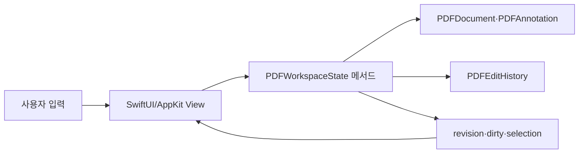

# 처음 기여자를 위한 HwattakPDF 코드 안내

이 문서는 Swift와 SwiftUI를 이제 배우는 사람도 “어디서 시작해야 할지” 찾을 수 있게 현재 구조를 작은 단위로 설명합니다. 모든 구현 세부 사항은 [아키텍처 문서](ARCHITECTURE.md)가 기준이고, 여기서는 코드를 읽는 순서와 실수하기 쉬운 경계를 다룹니다.

## 1. 먼저 알아둘 이름

- **HwattakPDF**: 앱·제품과 SwiftPM 패키지·실행 타깃 이름
- **HwattakPDFTests**: 실행 타깃을 검사하는 XCTest 타깃
- **workspace**: 주제별로 탭과 탭 스택을 나누는 공간
- **tab session**: PDF 한 개의 상태를 감싸는 탭
- **resident document**: 현재 메모리에 살아 있는 `PDFDocument`
- **hibernated tab**: URL과 보기 상태만 남기고 큰 PDFKit 객체를 해제한 깨끗한 비활성 탭
- **annotation**: PDF 원래 본문과 별도로 페이지 위에 놓이는 텍스트·잉크·스탬프 등의 객체
- **dirty**: 메모리의 변경이 마지막 저장 지점과 다름
- **conversion builder**: 열린 PDF를 직접 바꾸지 않고 이미지·HTML·선택 PDF 페이지·공백에서 새 파생 PDF를 만드는 별도 작업 상태

## 2. 폴더를 읽는 순서

```text
Package.swift                  SwiftPM 타깃과 최소 macOS 버전
Sources/HwattakPDF/App/        앱 시작점, 메뉴, 종료 보호
Sources/HwattakPDF/Models/     관찰 가능한 상태와 순수한 값/알고리즘
Sources/HwattakPDF/Services/   저장, OCR, 보안 저장소, 파일·AI 작업
Sources/HwattakPDF/Views/      SwiftUI와 AppKit/PDFKit 연결 화면
Resources/                     Info.plist, 권한, 현지화, 이미지
Tests/HwattakPDFTests/         기능별 XCTest 회귀 테스트
Documentation/                 제품 경계, 설계, 운영 기록
scripts/                       아이콘 생성, 검증, 앱 번들 패키징
```

처음에는 `HwattakPDFApp.swift` → `TabbedWorkspaceView.swift` → `MultiDocumentWorkspaceState.swift` → `WorkspaceView.swift` → `PDFWorkspaceState.swift` 순으로 읽어 보세요. 화면, 여러 탭의 상태, 한 문서의 상태가 어떻게 분리되는지 보입니다.

## 3. 가장 중요한 상태 흐름



View가 PDF를 직접 여기저기 바꾸기 시작하면 dirty 표시, 실행 취소, 썸네일 갱신, 검색 취소가 서로 어긋납니다. 사용자 편집은 가능하면 `PDFWorkspaceState`의 한 메서드로 들어가고, 그 메서드가 문서 변경·이력 등록·revision 갱신을 한 흐름으로 책임지게 합니다.

## 4. 예제로 보는 기능 경로

### 문서를 열 때

1. `WorkspaceFilePanels` 또는 Finder drop이 URL을 받습니다.
2. `SecurityScopedAccess`가 샌드박스 밖 URL의 접근 수명을 관리합니다.
3. 여러 파일은 가벼운 검사 후 `MultiDocumentWorkspaceState`가 탭 세션으로 만듭니다.
4. 활성 탭만 실제 `PDFDocument`와 `PDFView`를 우선 유지합니다.

Finder의 더블클릭·“다음으로 열기” 요청은 `AppExternalFileOpenCoordinator`가 앱 시작 전후와 창 수명에 걸쳐 보관합니다. 창을 먼저 표시한 뒤 묶음 요청의 중복을 제거해 탭으로 전달합니다.

주의: security-scoped 접근은 한 번 호출하고 잊는 권한 플래그가 아닙니다. 접근 시작과 종료가 객체 수명에 맞아야 하고, 재실행하려면 bookmark가 필요합니다. 기존 저장 식별자와 과거 PDF 주석 접두사는 호환성 때문에 유지하며, 타입·파일명을 바꾸는 작업과 구분합니다.

### 편집하고 되돌릴 때

1. View가 페이지 좌표와 사용자 값을 상태 메서드로 전달합니다.
2. 상태가 PDF 주석 또는 페이지를 바꿉니다.
3. 정방향과 역방향 동작을 `PDFEditCommand`로 기록합니다.
4. revision과 저장 토큰을 비교해 UI를 갱신합니다.
5. `⌘Z`는 역방향, `⇧⌘Z`는 정방향을 다시 실행합니다.

명령 closure가 불필요하게 전체 `PDFDocument`를 붙들면 clean 탭을 휴면해도 메모리가 내려가지 않습니다. 변경한 주석·페이지·좌표만 보관하는 이유입니다.

### 문서를 저장할 때

1. 문서를 열거나 휴면에서 재개할 때 `PDFSourceFileVersion`이 크기·수정일·파일시스템 node의 baseline을 기록합니다.
2. 같은 원본에 저장하면 `NSFileCoordinator`의 write accessor 안에서 현재 버전과 baseline을 비교합니다.
3. 다른 앱이 파일을 바꿨거나 삭제했다면 외부 bytes를 건드리지 않고 실패합니다. 메모리 편집과 dirty 상태는 남아 있어 별도 저장으로 복구할 수 있습니다.
4. 버전이 같으면 PDFKit 문서를 목적지와 같은 파일시스템의 임시 파일로 직렬화하고 검증한 뒤 교체합니다. 샌드박스가 sibling 임시 파일을 막는 경우에만 완전한 메모리 PDF를 먼저 검증하고 직접 쓴 뒤 다시 엽니다.
5. 임시 PDF를 다시 열어 최소 무결성과 페이지 수를 검사한 뒤 기존 목적지를 교체합니다.
6. 성공한 뒤 새 baseline, 저장 토큰과 UI 상태를 갱신합니다.

중간 단계가 실패하면 원본과 메모리 편집을 지키고 사용자가 다시 시도할 수 있어야 합니다. 저장 코드를 고칠 때 성공 경로보다 외부 atomic replacement, 원본 삭제, Save As 복구 같은 실패 경로 테스트를 먼저 생각하세요. 이 metadata 비교는 우발 충돌 방지이지 파일 인증이나 실시간 변경 감시는 아닙니다.

### 전체 문서를 검색할 때

1. 메인 액터에서 한 페이지의 텍스트 문자열만 얻습니다.
2. NFKC와 공백·발음 구별 부호 등을 정규화하는 계산은 detached worker가 합니다.
3. 가벼운 UTF-16 범위와 snippet만 결과에 저장합니다.
4. 현재 결과 한 건만 `PDFSelection`으로 만들어 PDFKit에 강조합니다.
5. query, 문서 revision, generation이 달라졌다면 늦게 도착한 결과를 버립니다.

PDFSelection 수천 개를 결과 배열에 보관하지 않는 것은 검색 결과가 PDFKit 객체 그래프 전체를 붙드는 일을 막기 위해서입니다.

### OCR을 실행할 때

UI가 사용하는 살아 있는 문서를 background task에 직접 넘기지 않습니다. 임시 PDF 스냅샷을 만들고 Vision이 한 페이지씩 인식하며, 각 결과를 독립된 체크포인트로 저장합니다. 취소 뒤 같은 문서·설정으로 다시 시작하면 완료 페이지를 재사용합니다.

체크포인트는 Keychain이 아니라 Application Support의 평문 JSON이며 인식한 원문과 위치 상자를 포함합니다. 현재 자동 만료·삭제 UI가 없으므로 fixture에는 실제 민감 문서를 쓰지 않고, 체크포인트 형식이나 위치를 바꾸는 PR은 migration뿐 아니라 보존 기간·삭제 실패·사용자 고지까지 함께 검토합니다.

### 이미지·HTML에서 새 PDF를 만들 때

1. `ImagePDFBuilderView`는 입력 목록, 처리 방식, 예상치와 진행 상태만 표시합니다.
2. `ImagePDFAssemblyModel`이 security scope와 immutable export snapshot을 소유하고 source를 한 항목씩 조립합니다.
3. `ImagePDFConverter`는 decode 예산 안의 이미지 페이지를, `HTMLPDFConverter`는 로컬 자원만 사용하는 A4 벡터 페이지들을 만듭니다.
4. 선택한 OCR은 기존 Vision·검색 가능 PDF exporter를 재사용합니다.
5. 저장 뒤 결과 PDF를 다시 열어 페이지 수를 확인한 다음 실제 시간과 용량을 게시합니다.

속도 우선도 `PDFDocument`를 여러 스레드에서 동시에 바꾸지 않습니다. 차이는 이미지 decode 예산, HTML 준비 대기, OCR DPI·인식 품질입니다. HTML에는 로컬 JavaScript가 실행되므로 테스트에는 실제 사용자 문서 대신 합성 fixture만 쓰고, 원격 차단을 완전한 process sandbox라고 설명하지 않습니다.

## 5. 좌표계가 세 종류인 이유

- AppKit view 좌표: 마우스와 트랙패드 이벤트 위치
- PDF page 좌표: 주석 bounds와 페이지 내용 위치
- Vision 정규화 좌표: OCR 상자를 0~1 비율로 표현

회전된 페이지, crop box, 원점이 0이 아닌 PDF에서는 단순히 `x * width`, `y * height`만으로 충분하지 않을 수 있습니다. 가능한 경우 PDFKit의 `convert` API를 사용하고, 변환식을 추가하면 회전·혼합 크기 fixture 테스트를 함께 작성합니다.

## 6. 작은 변경을 시작하는 방법

처음 기여라면 다음처럼 범위가 분명한 작업이 좋습니다.

- 기존 오류 메시지의 오탈자와 10개 현지화 키 일치 수정
- 도움말과 실제 단축키 불일치에 대한 테스트 추가
- 순수 값 타입의 경계값 테스트
- 문서에 현재 코드의 이유를 설명하는 주석 보강
- 합성 PDF fixture로 회전·빈 문서·다국어 검색 회귀 추가

새 AI 공급자, PDF 저장 방식 교체, 탭 세션 소유권 변경은 여러 보안·수명 경계를 건드리므로 첫 작업으로는 권하지 않습니다.

## 7. 테스트를 읽는 법

`Tests/HwattakPDFTests`는 기능 이름별로 나뉩니다. 테스트 이름은 사용자가 기대하는 동작을 문장처럼 표현해야 합니다. 좋은 회귀 테스트는 다음 네 부분이 보입니다.

1. 작은 입력 또는 합성 PDF 준비
2. 한 가지 사용자 동작 실행
3. 눈에 보이는 상태와 내부 안전 조건 확인
4. 임시 파일·task·observer 정리

실제 PDF가 필요하면 코드로 최소 PDF를 만드는 방식을 우선합니다. 상업 교재나 개인정보 문서를 저장소에 넣지 않습니다. 비동기 테스트는 고정된 긴 sleep보다 완료 조건이나 controllable seam을 기다립니다.

## 8. 현지화 변경 순서

1. 의미가 안정적인 localization key를 정합니다.
2. 한국어와 영어 문구를 작성합니다.
3. 나머지 8개 언어에 같은 키와 format placeholder를 추가합니다.
4. `%@`, `%d`의 개수와 순서가 언어마다 맞는지 검사합니다.
5. 긴 번역, VoiceOver, 아랍어 RTL에서 UI가 잘리지 않는지 봅니다.

`./scripts/validate_project.sh`는 plist/strings 문법과 키 집합의 기본적인 불일치를 검사합니다. 자연스러운 번역 품질은 자동 검사만으로 보장되지 않습니다.

## 9. 막혔을 때 남길 기록

Issue나 PR에 아래 내용을 적으면 다음 사람이 이어가기 쉽습니다.

- 사용한 앱·macOS 버전
- 재현하는 가장 짧은 단계
- 기대 결과와 실제 결과
- 관련 상태의 소유자와 의심한 불변 조건
- 실행한 테스트와 아직 실행하지 못한 수동 확인
- 성능 문제라면 문서 크기·페이지 수·resident 탭 수와 Instruments 측정 방식

정확한 원인을 아직 몰라도 괜찮습니다. 관찰한 사실과 추측을 분리해 쓰는 것이 가장 중요한 유지보수 습관입니다.
