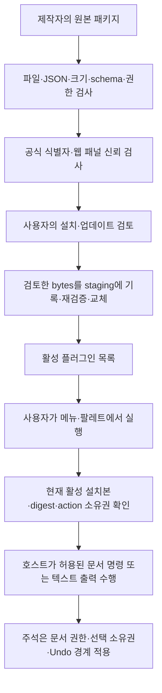

# 플러그인 제작자와 검토자를 위한 보안 가이드

2026-09-05 안정화 구현 기준. 제작자는 패키지가 읽고 바꾸고 전달하는 데이터를 설명하고, 호스트는 선언한 기능과 문서 변경 경계를 검사한다. “플러그인 검증 통과”는 제작자 신원 인증이나 무해성 보증이 아니다.

[제작 가이드](PLUGIN-DEVELOPMENT.md) · [호환성/향후 SDK](PLUGIN-COMPATIBILITY.md) · [취약점 비공개 제보](../SECURITY.md)

## 1. 패키지가 실행되는 경로

실행 시 digest 확인은 **현재 메모리 registry와 메뉴가 캡처한 설치본**을 비교하는 것이다. 매 명령마다 디스크의 모든 파일을 새로 해시하는 것은 아니다. 설치본의 manifest 변조는 설치·로드·새로 고침 경로에서 검사한다. 설치 검토와 최종 교체 사이에는 검토 당시 읽은 제한된 bytes를 사용해 원본 폴더의 사후 변경을 그대로 가져오지 않는다.

## 2. 현재 막는 것과 그 한계

| 경계 | 현재 구현 | 한계/제작자의 책임 |
| --- | --- | --- |
| 실행 파일/숨겨진 코드 | 허용 파일명 5개, 일반 파일만 허용. 하위 디렉터리·심볼릭 링크·추가 파일 거부 | 앱/PDFKit/OS 자체의 모든 취약점을 없애는 보장은 아님 |
| 모호한 manifest | BOM·중복 JSON 키·알 수 없는 키/enum·잘못된 타입/범위 거부 | JSON 문법 검사만으로 호스트 규칙을 대신하지 않음 |
| 과도한 입력/결과 | 패키지·manifest·action·출력·URL 크기 상한 | PDF 자체가 복잡하면 렌더링 비용이 발생. 대용량 실기기 테스트 필요 |
| 권한 확대 | 모든 action이 요구하는 권한의 정확한 합집합 요구 | 권한별 토글 없음. 사용자는 플러그인 전체를 끄거나 제거 |
| 공식 플러그인 사칭 | 공식 예약 ID와 패널은 앱 번들의 identifier+manifest digest 일치 요구 | 일반 제작자 ID는 전 세계 소유권을 인증하지 않음 |
| 설치본 변경 | manifest digest·설치 기록·디렉터리 식별자 검사, 실패 시 로드 제외 | 설치 기록과 payload를 모두 바꿀 수 있는 로컬 공격자를 인증으로 막는 장치가 아님 |
| 오래된 실행 요청 | 활성 상태·현재 digest·action 소유권 재확인 | 이미 실행해 PDF에 만든 주석은 제거/비활성화로 자동 롤백하지 않음 |
| PDF 주석 변경 | 현재 문서/선택 객체·모드/문서 권한 확인, 기존 Undo/Redo 사용 | 원본 콘텐츠 스트림 편집·보안 삭제·인증서 디지털 서명 API는 없음 |

`icon.png`는 현재 PNG signature만 검사하며 UI 아이콘으로 사용하지 않는다. README·라이선스·icon을 포함한 모든 보조 파일의 진위가 manifest SHA-256으로 인증되는 것은 아니다. 저작권과 출처는 별도로 확인한다.

## 3. 읽기·수정·외부 전송을 구분하기

### 로컬 문서 명령

`annotationWrite`는 현재 선택에 주석을 추가하는 호스트 명령이다. 텍스트 추출 권한인 `selectedText`와 분리되어 있다. `toolControl`은 펜·지우개·선택 도구를 설정하고, `workspaceNavigation`은 모드/페이지를 바꾼다. 이 권한들이 임의 파일 쓰기, 앱 설정 전체 변경, 장치 접근, 네트워크 권한을 뜻하지 않는다.

주석을 만들면 문서는 미저장 상태가 되고 사용자 저장 흐름을 따른다. 호스트의 자동 복구 설정이 켜져 있으면 로컬 복구 사본이 생길 수 있다. “파일을 자동으로 덮어쓰지 않음”을 “어떤 로컬 데이터도 남지 않음”으로 설명하지 않는다. 암호화 문서는 기존 문서 권한과 보호된 저장 정책을 따른다.

외부 PDF가 `HwattakPDF`와 같은 Stamp 이름을 붙여도 학습 모드에서 신뢰된 주석이 되지는 않는다. 해당 세션에서 확인한 객체 신뢰와 에디팅 모드의 명시적 편집 경계를 유지한다.

### 텍스트·클립보드

선택 텍스트·문서 이름에는 개인정보가 있을 수 있다. 필요한 토큰만 사용하고 문서 전체를 읽는 기능인 것처럼 설명하지 않는다. 현재 페이지 전체 텍스트 토큰은 공식 번역 패널 전용이다. 선택은 제한된 길이로 캡처되며 결과가 상한을 넘으면 실패할 수 있다.

`copyText`는 시스템의 일반 클립보드에 쓴다. 다른 앱이나 시스템의 클립보드 기능이 해당 내용을 취급할 수 있다. 클립보드 권한을 네트워크가 없는 비밀 저장소라고 설명하지 않는다. manifest와 README에 비밀번호·API 키·토큰·실제 계약서 내용을 넣지 않는다. 패키지 전용 Keychain/비밀 저장 API는 없다.

### 공개 HTTPS 링크

`openURL`은 대상과 문서 metadata/선택 텍스트 포함 여부를 확인한 뒤 외부 브라우저를 연다. 취소는 정상 종료다. 제작자는 README에 서비스 이름·도메인·전달되는 데이터를 밝힌다.

URL의 `.urlEncoded`는 문자 구분 문제를 막는 인코딩이다. 익명화가 아니며 서버·브라우저 기록 등에 질의가 남을 수 있다. HTTPS는 대상의 선의나 개인정보 보존 정책을 인증하지 않는다. 비밀 키를 query에 넣거나, 설치 검토 문구를 속여 사용자 확인을 유도하지 않는다. `http:`, `file:`, `javascript:`, `obsidian:` 및 내부 주소를 허용하려고 검증기를 우회하지 않는다.

### 호스트가 소유한 웹 패널

일반 커뮤니티 패키지는 자체 HTML/JS 패널을 넣을 수 없다. 허용된 공식 패널은 원격 웹사이트를 WebKit으로 열 수 있으며 원격 페이지의 JavaScript는 실행될 수 있다. 패키지 코드 실행과 원격 사이트 동작을 구분한다.

현재 패널은 비영구 데이터 저장소와 이동/입출력 제한, 문서·탭·플러그인 수명에 연결된 폐기를 사용한다. 완전한 네트워크 방화벽, 추적 방지, 서버 측 삭제를 보장하지 않는다. 번역 서비스별 실제 전송 흐름은 [기존 패널 가이드](PLUGINS.md)에 있다. YouTube 검토용 소스를 공식 번들에 넣는 것은 별도의 배포 검토가 필요한 변경이다.

## 4. 제작·배포 검토

| 시점 | 확인할 내용 |
| --- | --- |
| 설계 | 필요한 최소 권한, 사용자 실행/취소, 원본 보존, Undo, 데이터 수명 |
| 구현 | 지원 필드만 사용, 공개된 코드와 패키지 일치, 비밀/실제 PDF 제외 |
| 검증 | 앱의 native 검사기, 권한 거부·잘못된 문서·업데이트·취소 사례 |
| 배포 | 실제 제작자·소스·라이선스·지원 환경·데이터 흐름·보안 연락 방법 공개 |
| 업데이트 | 새 권한과 전송 대상, 변경 이유, 호환성/되돌리기 안내 |
| 사고 대응 | 문제가 있는 릴리스 안내, 수정 배포, 필요 시 비활성화 권고와 비공개 취약점 신고 |

현재 온라인 카탈로그·자동 악성 패키지 검사·게시자 서명·자동 취약 버전 차단은 구현되지 않았다. 파일 checksum과 manifest digest를 제공할 수 있지만 이것을 “공식 보안 인증”이라고 부르지 않는다. 앱의 검사 성공 문구만으로 안전한 출처라고 단정하지 않는다.

## 5. 향후 실행형 SDK의 보안 요구 — 제안

Obsidian은 커뮤니티 플러그인이 앱의 접근 수준을 상속하며 권한별 제한에 기술적 한계가 있다고 안내한다. [Obsidian 공식 보안 안내](https://obsidian.md/help/plugin-security). HwattakPDF가 사용자 코드 실행을 열 때는 현재 JSON 명령 권한만으로 그런 코드를 격리할 수 있다고 가정하지 않는다.

제안하는 기준은 프로세스/런타임 격리, 요청별 제한된 RPC, 기본 권한 없음, 명시적 네트워크·파일 권한, 메모리·CPU·시간·동시성 상한, 취소/강제 종료, 문서별 일시적인 접근과 철회다. 호스트의 PDFKit 객체·전체 경로·Keychain을 통째로 노출하지 않는다. 수정은 호스트가 검사하는 Undo transaction으로만 요청한다.

자동 이벤트도 재진입·무한 반복·탭 전환 뒤의 오래된 실행을 다뤄야 한다. 사용자 코드가 멈춰도 문서의 미저장 변경과 앱 UI가 보존되는지 시험한 후 지원 API로 공개한다. 이 기준은 아직 구현된 JavaScript SDK 설명이 아니다.

## 6. 취약점 신고

공개 이슈에는 취약점 악용 절차·민감한 PDF·API 키·서명·개인 경로를 올리지 않는다. [SECURITY.md](../SECURITY.md)의 비공개 신고 절차와 실제 연락 경로를 사용한다. 버전/빌드·schema·플러그인 identifier/version/digest, 공격 전제, 비식별화된 재현 절차를 준비한다. 신고 창이 없으면 공개로 대체하지 않고 기존 정책을 따른다.
